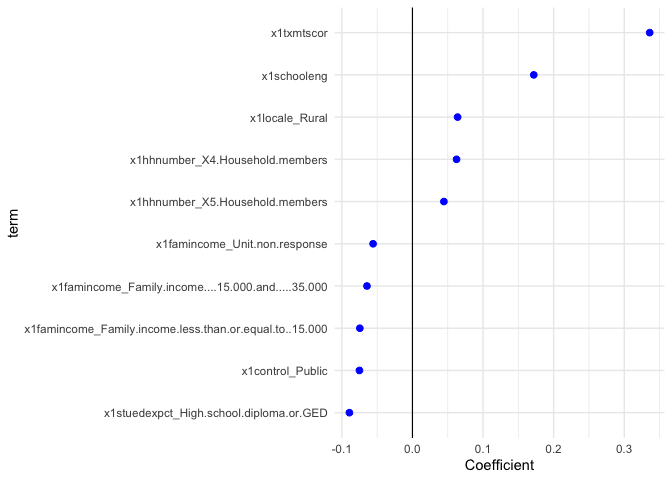

Introduction to Tidyverse/Tidymodels
================
Will Doyle
2026-01-08

## Datset

The dataset for this session comes from HSLS, which is nationally
representative sample of ninth graders as of 2009. The data combines
questionnaire information and transcript information.

## Outcome of interest

We want to predict total HS GPA from a set of characteristics of
incoming ninth graders. The use case here is quickly identifying those
students that may end up with low GPAs so they can be targeted for early
interventions.

## Measure of accuracy

We’ll use root mean sqaure error (rmse) as our measure of accuracy.

## Load libraries

``` r
library(tidyverse)
```

    ## ── Attaching core tidyverse packages ──────────────────────── tidyverse 2.0.0 ──
    ## ✔ dplyr     1.1.4     ✔ readr     2.1.5
    ## ✔ forcats   1.0.0     ✔ stringr   1.6.0
    ## ✔ ggplot2   4.0.0     ✔ tibble    3.3.0
    ## ✔ lubridate 1.9.4     ✔ tidyr     1.3.1
    ## ✔ purrr     1.1.0     
    ## ── Conflicts ────────────────────────────────────────── tidyverse_conflicts() ──
    ## ✖ dplyr::filter() masks stats::filter()
    ## ✖ dplyr::lag()    masks stats::lag()
    ## ℹ Use the conflicted package (<http://conflicted.r-lib.org/>) to force all conflicts to become errors

``` r
library(tidymodels)
```

    ## ── Attaching packages ────────────────────────────────────── tidymodels 1.4.1 ──
    ## ✔ broom        1.0.10     ✔ rsample      1.3.1 
    ## ✔ dials        1.4.2      ✔ tailor       0.1.0 
    ## ✔ infer        1.0.9      ✔ tune         2.0.1 
    ## ✔ modeldata    1.5.1      ✔ workflows    1.3.0 
    ## ✔ parsnip      1.3.3      ✔ workflowsets 1.1.1 
    ## ✔ recipes      1.3.1      ✔ yardstick    1.3.2 
    ## ── Conflicts ───────────────────────────────────────── tidymodels_conflicts() ──
    ## ✖ scales::discard() masks purrr::discard()
    ## ✖ dplyr::filter()   masks stats::filter()
    ## ✖ recipes::fixed()  masks stringr::fixed()
    ## ✖ dplyr::lag()      masks stats::lag()
    ## ✖ yardstick::spec() masks readr::spec()
    ## ✖ recipes::step()   masks stats::step()

``` r
library(janitor)
```

    ## 
    ## Attaching package: 'janitor'
    ## 
    ## The following objects are masked from 'package:stats':
    ## 
    ##     chisq.test, fisher.test

## Load dataset

``` r
hs<-read_csv("hsls_extract.csv")%>%clean_names()
```

    ## Rows: 23503 Columns: 12
    ## ── Column specification ────────────────────────────────────────────────────────
    ## Delimiter: ","
    ## chr (9): X1PAR1EDU, X1PAR1EMP, X1HHNUMBER, X1FAMINCOME, X1STUEDEXPCT, X1IEPF...
    ## dbl (3): X1TXMTSCOR, X1SCHOOLENG, X3TGPATOT
    ## 
    ## ℹ Use `spec()` to retrieve the full column specification for this data.
    ## ℹ Specify the column types or set `show_col_types = FALSE` to quiet this message.

## Codebook

Categorical/factor variables marked with (f)

x3gpatot: Final HS GPA

x1region: Region of the country (f)

x1locale: Locale (f)

x1control: Control (f)

x1iepflag: IEP Flag (f)

x1stuedexpct: Student expectations for educational attainment (f)

x1schooleng: Student engagement

x1famincome: Family income (f)

x1hhnumber: Number in household (f)

x1par1emp: Parent’s employment status (f)

x1par1edu: Parent’s education level (f)

x1tmtscor: Math theta score in ninth grade

## Data Cleaning

I need to properly code missing data, and then drop any cases with
missing data. This won’t always be our approach.

``` r
hs <- hs %>%
 mutate(across(where(is.numeric) ,
                ~ replace(.x, .x %in% -9:-1, NA))) %>%
  drop_na()
```

I know that in the nces coding scheme values from -1 to -9 indicate
missing data, so the above code replaces those missing values with NA.

## Tidymodels

`tidymodels` is a collection of R packages that provides a consistent
and tidy approach to building, evaluating, and tuning statistical
models. It integrates various stages of the modeling process, from data
preprocessing to model evaluation, under a unified framework that’s easy
to use and aligns with the principles of the `tidyverse`.

**Philosophy**:

- **Tidy Data Principles**: `tidymodels` is built on the same principles
  as the `tidyverse`, emphasizing clear, readable, and consistent code.
  It’s designed to work seamlessly with other `tidyverse` packages.

- **Unified Interface**: It offers a consistent interface for various
  modeling tasks, regardless of the underlying model type.

**Components**:

- **`recipes`**: Provides tools for feature engineering and data
  preprocessing. It allows you to specify a series of steps to prepare
  your data for modeling.

- **`parsnip`**: A unified interface for model specification. It allows
  you to define a model without committing to a specific computational
  engine.

- **`workflows`**: Combines pre-processing steps from `recipes` and
  model specifications from `parsnip` into a single object to streamline
  the modeling process.

- **`tune`**: Tools for model tuning, such as grid search and
  cross-validation.

- **`yardstick`**: For model evaluation and metric calculation.

- **`dials`**: Helps in creating tuning grids for different model
  parameters.

- **`rsample`**: Provides infrastructure for data splitting and
  resampling, which is essential for model validation and testing.

**Workflow**:

- **Data Splitting**: Using `rsample`, you can create training and
  testing datasets.

- **Preprocessing**: With `recipes`, you define a series of
  preprocessing steps like normalization, encoding categorical
  variables, and more.

- **Model Specification**: Using `parsnip`, you specify the type of
  model you want (e.g., linear regression, decision tree) without
  choosing the computational engine (e.g., lm, xgboost).

- **Combining Preprocessing and Modeling**: `workflows` lets you combine
  your preprocessing steps and model specification into a single object.

- **Model Training**: Train your model on the training data.

- **Model Evaluation**: Once trained, you can evaluate your model’s
  performance on the testing data using `yardstick`.

- **Tuning (if needed)**: If your model has hyperparameters, you can use
  `tune` and `dials` to find the best parameters.

**Advantages**:

- **Flexibility**: Easily switch between different model types or
  computational engines without drastically changing your code.

- **Consistency**: Regardless of the model type, the code structure
  remains consistent.

- **Integration**: Designed to work seamlessly with other `tidyverse`
  packages, making it easier to integrate modeling into a broader data
  analysis pipeline.

Below I’ll use tidymodels to run a regresion predicting overall HS GPA
from the incoming student characteristics.

## Splitting into training and testing

The code is dividing the `hs` dataset into two parts: a training set
(`train`) to teach a machine learning model and a testing set (`test`)
to evaluate how well the model has learned. This split ensures that the
model is evaluated on data it hasn’t seen before, providing a more
realistic assessment of its performance.

``` r
hs_split<-initial_split(hs)

train<-training(hs_split)

test<-testing(hs_split)
```

**`hs_split <- initial_split(hs)`**:

- This line uses the `initial_split` function to divide the `cr` dataset
  into two parts. By default, `initial_split` typically allocates 75% of
  the data to the training set and the remaining 25% to the testing set,
  though this ratio can be adjusted.

- The result, `cr_split`, is a special split object that contains
  information about which rows of the original `cr` dataset belong to
  the training set and which belong to the testing set.

**`train <- training(hs_split)`**:

- Here, the `training` function extracts the training portion of the
  data from the `cr_split` object and assigns it to the `train`
  variable. This dataset will be used to train a machine learning model.

**`test <- testing(hs_split)`**:

- Similarly, the `testing` function extracts the testing portion of the
  data from the `cr_split` object and assigns it to the `test` variable.
  This dataset will be used to evaluate the performance of the trained
  model on unseen data.

The code is setting up a linear regression model using the standard
linear modeling engine in R.

``` r
hs_model<-linear_reg(mode="regression",engine="lm")
```

**Detailed Explanation**:

- **`linear_reg(mode="regression", engine="lm")`**:

  - **`linear_reg()`**: This function is from the `parsnip` package,
    which is part of the `tidymodels` framework. It’s used to specify a
    linear regression model.

  - **`mode="regression"`**: This argument specifies the type of
    modeling. In this case, it’s regression, which is used to predict a
    continuous outcome variable based on one or more predictor
    variables.

  - **`engine="lm"`**: This argument specifies the computational engine
    to use for the linear regression. The “lm” engine refers to R’s
    built-in `lm()` function for linear modeling.

- **`hs_model`**: The specified linear regression model is then stored
  in the `hs_model` variable. This doesn’t train the model yet. It sets
  up the type of model and the engine to be used. Training the model
  would require additional steps using the training data.

## Set Recipe

In the tidymodels framework, recipes is a package that provides a
streamlined way to define and preprocess data for modeling. It allows
users to specify a series of steps to transform and preprocess data,
such as normalization, encoding categorical variables, and handling
missing values. These steps are defined in a consistent and reproducible
manner, creating a “recipe” that can be applied to multiple datasets.
This ensures that data transformations are consistent across different
stages of the modeling process, which makes model training and
validation much easier. Essentially, `recipes` offers a tidy and
systematic approach to data preparation in the modeling workflow.

The code below is preparing the data for modeling. It sets up a series
of steps to process the data, such as handling missing values,
converting categorical variables into a format suitable for modeling,
and normalizing the data.

``` r
hs_formula<-as.formula("x3tgpatot~.")

hs_rec<-recipe(hs_formula,data=train)%>%
  update_role(x3tgpatot,new_role = "outcome")%>%
  step_other(all_nominal_predictors(),threshold = .01)%>%
  step_dummy(all_nominal_predictors())%>%
  step_filter_missing(all_predictors(),threshold = .1)%>%
  step_naomit(all_outcomes(),all_predictors())%>%
  step_corr(all_predictors(),threshold = .95)%>%
  step_zv(all_predictors())%>%
  step_normalize(all_predictors())
```

The code is preparing the data for modeling. It sets up a series of
steps to process the data, such as handling missing values, converting
categorical variables into a format suitable for modeling, and
normalizing the data.

**Detailed Explanation**:

1.  **`hs_formula <- as.formula("x3gpatot~.")`**:

    - This creates a formula indicating that the variable `x3gpatot` is
      the outcome (or dependent variable) we want to predict, and the
      `.` means we want to use all other variables in the dataset as
      predictors (or independent variables).

2.  **`recipe(hs_formula, data=train)`**:

    - The `recipe` function starts the specification of preprocessing
      steps. It uses the formula and the training data (`train`) as
      inputs.

3.  **`update_role(x3gpatot, new_role = "outcome")`**:

    - This explicitly sets the role of the `x3gpatot` variable as the
      “outcome” or the variable we’re trying to predict.

4.  **`step_other(all_nominal_predictors(), threshold = .01)`**:

    - For categorical (nominal) predictors, any categories that
      constitute less than 1% of the data will be lumped together into a
      new category, typically called “other”.

5.  **`step_dummy(all_nominal_predictors())`**:

    - Converts categorical variables into dummy variables (also known as
      one-hot encoding). This is necessary because many modeling
      algorithms require numerical input.

6.  **`step_filter_missing(all_predictors(), threshold = .1)`**:

    - This step removes any predictor variables that have more than 10%
      missing values.

7.  **`step_naomit(all_outcomes(), all_predictors())`**:

    - Removes rows (observations) from the data where either the outcome
      or any of the predictor variables have missing values.

8.  **`step_corr(all_predictors(), threshold = .95)`**:

    - Identifies and removes predictor variables that have a correlation
      higher than 0.95 with any other predictor. This helps in
      addressing multicollinearity.

9.  **`step_zv(all_predictors())`**:

    - Removes predictor variables that have a zero variance, meaning
      they have the same value for all observations.

10. **`step_normalize(all_predictors())`**:

- Normalizes all predictor variables so they have a mean of 0 and a
  standard deviation of 1. We’ll do this for everything, it’s a fairly
  standard step.

The result of all these steps is stored in `hs_rec`, which can then be
used to preprocess the training data and any future data in a consistent
manner before modeling.

## Viewing the results of feature engineering

``` r
hs_rec%>%prep()
```

    ## 

    ## ── Recipe ──────────────────────────────────────────────────────────────────────

    ## 

    ## ── Inputs

    ## Number of variables by role

    ## outcome:    1
    ## predictor: 11

    ## 

    ## ── Training information

    ## Training data contained 14445 data points and no incomplete rows.

    ## 

    ## ── Operations

    ## • Collapsing factor levels for: x1hhnumber x1famincome, ... | Trained

    ## • Dummy variables from: x1par1edu, x1par1emp, x1hhnumber, ... | Trained

    ## • Missing value column filter removed: <none> | Trained

    ## • Removing rows with NA values in: x3tgpatot x1txmtscor, ... | Trained

    ## • Correlation filter on: x1par1edu_Unit.non.response, ... | Trained

    ## • Zero variance filter removed: <none> | Trained

    ## • Centering and scaling for: x1txmtscor x1schooleng, ... | Trained

``` r
hs_rec%>%prep()%>%bake(train)
```

    ## # A tibble: 14,445 × 47
    ##    x1txmtscor x1schooleng x3tgpatot x1par1edu_Bachelor.s.degree
    ##         <dbl>       <dbl>     <dbl>                       <dbl>
    ##  1    -0.0424     -1.03         2.5                      -0.466
    ##  2     0.258      -0.291        2.5                      -0.466
    ##  3    -0.212       0.562        2                        -0.466
    ##  4    -2.24        0.151        2                        -0.466
    ##  5    -0.665       0.521        3                        -0.466
    ##  6     1.08        0.901        3                        -0.466
    ##  7     1.63        0.0176       3                         2.14 
    ##  8    -0.141       0.901        3.5                      -0.466
    ##  9    -0.341       0.562        3                        -0.466
    ## 10     0.366       0.449        3                        -0.466
    ## # ℹ 14,435 more rows
    ## # ℹ 43 more variables: x1par1edu_High.school.diploma.or.GED <dbl>,
    ## #   x1par1edu_Less.than.high.school <dbl>, x1par1edu_Master.s.degree <dbl>,
    ## #   x1par1edu_Ph.D.M.D.Law.other.high.lvl.prof.degree <dbl>,
    ## #   x1par1emp_P1.currently.working.PT...35.hrs.wk. <dbl>,
    ## #   x1par1emp_P1.has.never.worked.for.pay <dbl>,
    ## #   x1par1emp_P1.not.currently.working.for.pay <dbl>, …

1.  **`hs_rec %>% prep()`**:

    - **`prep()`**: This function prepares the steps defined in the
      `cr_rec` recipe. It computes any required statistics or parameters
      needed for the transformations (e.g., mean and standard deviation
      for normalization) but doesn’t apply the transformations to the
      data yet. Think of it as getting the recipe ready for cooking but
      not actually cooking.

2.  **`hs_rec %>% prep() %>% bake(train)`**:

    - **`bake()`**: Once the recipe is prepared with `prep()`, the
      `bake()` function is used to apply the transformations to a
      dataset. In this case, the transformations are applied to the
      `train` dataset.

    - Essentially, this sequence of functions means “prepare the
      transformations and then apply them to the `train` dataset.”

By separating the `prep()` and `bake()` steps, `tidymodels` allows for a
consistent set of transformations to be easily applied to different
datasets, ensuring that both training and testing data undergo the same
preprocessing.

## Creating a workflow and fitting the model

``` r
hs_wf<-workflow()%>%
  add_model(hs_model)%>%
  add_recipe(hs_rec)%>%
  fit(train)
```

The code is setting up a workflow that combines both the data
preprocessing steps (from `hs_rec`) and the modeling specification (from
`hs_model`). It then trains the model using the `train` dataset.

1.  **`workflow()`**:

    - This function initializes a workflow. In the `tidymodels`
      framework, a workflow is a way to bundle together preprocessing
      steps (like those defined in a recipe) and a model specification.

2.  **`add_model(cr_model)`**:

    - This adds the model specification from `hs_model` (which was
      defined earlier) to the workflow. It tells the workflow what kind
      of model we’re planning to train.

3.  **`add_recipe(cr_rec)`**:

    - This adds the data preprocessing steps from `hs_rec` (which were
      defined earlier) to the workflow. It tells the workflow how to
      preprocess the data before training the model.

4.  **`fit(train)`**:

    - Once the workflow has both the model and the recipe, the `fit()`
      function is used to train the model using the `train` dataset.
      This involves applying the preprocessing steps to the training
      data and then training the model on the processed data.

The result is stored in `hs_wf`. This object now contains the trained
model along with all the preprocessing steps, making it ready for
predictions on new data.

## Testing predictions in the testing split

``` r
test<-
  augment(hs_wf, new_data = test)
```

Using `augment()` with the fitted workflow `hs_wf` appends predictions
to the test data. Under the hood, it first applies the trained recipe to
test (the same preprocessing learned from `train`), then uses the fitted
model inside `hs_wf` to generate predicted GPA values, which are
returned in a `.pred` column (for regression).

For a linear model, you can think of this as computing

$$ \hat{y}=X_i\beta$$

``` r
test%>%
  rmse(truth="x3tgpatot",estimate=.pred)
```

    ## # A tibble: 1 × 3
    ##   .metric .estimator .estimate
    ##   <chr>   <chr>          <dbl>
    ## 1 rmse    standard       0.646

The code calculates the Root Mean Squared Error (RMSE) for the
predictions in the `test` dataset by comparing the predicted values
(`.pred`) with the actual values (`x3tgpatot`).

**Detailed Explanation**:

1.  **`test %>%`**:

    - This takes the `test` dataset, which now contains both the actual
      values (`x3tgpatot`) and the predicted values (`.pred`), as the
      starting point for the subsequent operations.

2.  **`rmse(truth="iss", estimate=.pred)`**:

    - The `rmse()` function from the `yardstick` package (part of
      `tidymodels`) is used to calculate the RMSE.

    - **`truth="x3tgpatot"`**: Specifies that the actual values are in
      the `x3tgpatot` column of the `test` dataset.

    - **`estimate=.pred`**: Specifies that the predicted values are in
      the `.pred` column of the `test` dataset.

The result will be the RMSE value, which provides a measure of the
differences between the predicted and actual values. A lower RMSE
indicates a better fit of the model to the data, while a higher RMSE
suggests a poorer fit.

Note: Ensure that the `yardstick` package is loaded to use the `rmse()`
function.

## Examining Coefficients

Coefficients? Who cares about coefficients? We’ve already got an rmse!

The code fits the model above to the full dataset, extracts the
coefficients from the trained model from the workflow, organizes these
results in a tidy format, sorts them based on the magnitude of the
estimates (from highest to lowest), and then displays the top 100
results.

``` r
hs_wf_full<-
  hs_wf%>%
  fit(hs)

hs_wf_full%>%
  extract_fit_parsnip()%>%
  tidy()%>%
  arrange(-abs(estimate))%>%
  print(n=100)
```

    ## # A tibble: 47 × 5
    ##    term                                   estimate std.error statistic   p.value
    ##    <chr>                                     <dbl>     <dbl>     <dbl>     <dbl>
    ##  1 (Intercept)                             2.73e+0   0.00468   584.    0        
    ##  2 x1txmtscor                              3.36e-1   0.00543    61.9   0        
    ##  3 x1schooleng                             1.72e-1   0.00488    35.2   4.86e-263
    ##  4 x1stuedexpct_High.school.diploma.or.G… -8.93e-2   0.00600   -14.9   8.39e- 50
    ##  5 x1control_Public                       -7.51e-2   0.00513   -14.6   2.85e- 48
    ##  6 x1famincome_Family.income.less.than.o… -7.45e-2   0.00779    -9.57  1.20e- 21
    ##  7 x1famincome_Family.income....15.000.a… -6.44e-2   0.00930    -6.92  4.52e- 12
    ##  8 x1locale_Rural                          6.40e-2   0.00584    11.0   7.84e- 28
    ##  9 x1hhnumber_X4.Household.members         6.25e-2   0.0116      5.39  7.10e-  8
    ## 10 x1famincome_Unit.non.response          -5.58e-2   0.0156     -3.58  3.40e-  4
    ## 11 x1hhnumber_X5.Household.members         4.45e-2   0.0102      4.36  1.29e-  5
    ## 12 x1locale_Town                           4.28e-2   0.00533     8.03  1.05e- 15
    ## 13 x1stuedexpct_Don.t.know                -4.04e-2   0.00637    -6.34  2.28e- 10
    ## 14 x1stuedexpct_Complete.an.Associate.s.… -3.84e-2   0.00531    -7.25  4.48e- 13
    ## 15 x1par1edu_Bachelor.s.degree             3.72e-2   0.00696     5.34  9.22e-  8
    ## 16 x1par1edu_Master.s.degree               3.61e-2   0.00599     6.03  1.65e-  9
    ## 17 x1famincome_Family.income....35.000.a… -3.51e-2   0.00881    -3.98  6.79e-  5
    ## 18 x1hhnumber_X3.Household.members         2.61e-2   0.00964     2.71  6.83e-  3
    ## 19 x1hhnumber_X6.Household.members         2.49e-2   0.00791     3.15  1.66e-  3
    ## 20 x1region_South                         -2.43e-2   0.00584    -4.17  3.10e-  5
    ## 21 x1stuedexpct_Complete.a.Master.s.degr…  2.40e-2   0.00628     3.82  1.36e-  4
    ## 22 x1stuedexpct_other                     -2.16e-2   0.00498    -4.34  1.44e-  5
    ## 23 x1region_Northeast                     -2.12e-2   0.00544    -3.89  1.01e-  4
    ## 24 x1par1emp_P1.currently.working.PT...3…  1.96e-2   0.00498     3.93  8.35e-  5
    ## 25 x1hhnumber_X7.Household.members         1.82e-2   0.00620     2.94  3.24e-  3
    ## 26 x1par1edu_Less.than.high.school        -1.74e-2   0.00602    -2.90  3.79e-  3
    ## 27 x1stuedexpct_Complete.Ph.D.M.D.Law.ot…  1.54e-2   0.00636     2.42  1.55e-  2
    ## 28 x1par1edu_Ph.D.M.D.Law.other.high.lvl…  1.53e-2   0.00538     2.85  4.40e-  3
    ## 29 x1hhnumber_X8.Household.members         1.37e-2   0.00537     2.55  1.08e-  2
    ## 30 x1famincome_Family.income....55.000.a… -9.87e-3   0.00847    -1.16  2.44e-  1
    ## 31 x1locale_Suburb                         9.15e-3   0.00582     1.57  1.16e-  1
    ## 32 x1iepflag_Student.has.no.IEP            8.87e-3   0.00488     1.82  6.90e-  2
    ## 33 x1hhnumber_other                        8.35e-3   0.00525     1.59  1.12e-  1
    ## 34 x1stuedexpct_Start.a.Master.s.degree   -7.99e-3   0.00482    -1.66  9.71e-  2
    ## 35 x1par1emp_P1.not.currently.working.fo… -7.33e-3   0.00525    -1.40  1.63e-  1
    ## 36 x1famincome_Family.income....235.000    5.82e-3   0.00629     0.926 3.54e-  1
    ## 37 x1par1edu_High.school.diploma.or.GED   -5.38e-3   0.00750    -0.717 4.73e-  1
    ## 38 x1region_West                          -5.19e-3   0.00553    -0.938 3.48e-  1
    ## 39 x1famincome_Family.income....195.000.…  4.08e-3   0.00536     0.761 4.47e-  1
    ## 40 x1famincome_Family.income....75.000.a…  3.73e-3   0.00768     0.486 6.27e-  1
    ## 41 x1famincome_Family.income....95.000.a… -3.58e-3   0.00721    -0.496 6.20e-  1
    ## 42 x1famincome_Family.income....155.000.… -3.38e-3   0.00546    -0.619 5.36e-  1
    ## 43 x1famincome_Family.income....135.000.…  2.19e-3   0.00613     0.358 7.20e-  1
    ## 44 x1famincome_Family.income....175.000.…  1.15e-3   0.00522     0.221 8.25e-  1
    ## 45 x1iepflag_Student.has.an.IEP           -7.83e-4   0.00499    -0.157 8.75e-  1
    ## 46 x1par1emp_P1.has.never.worked.for.pay  -6.88e-4   0.00499    -0.138 8.90e-  1
    ## 47 x1famincome_other                      -5.12e-4   0.00496    -0.103 9.18e-  1

**Detailed Explanation**:

1.  **`hs_wf %>%`**:

    - This takes the trained workflow `cr_wf` as the starting point for
      the subsequent operations.

2.  **`extract_fit_parsnip()`**:

    - This function extracts the results of the trained model from the
      workflow. In the context of a linear regression model (as
      indicated by previous interactions), this would typically include
      coefficients for each predictor variable.

3.  **`tidy()`**:

    - This function, from the `broom` package, tidies the results of the
      model, converting them into a clean and standardized data frame
      format. For a linear regression model, this would typically result
      in a data frame with columns like `term` (the predictor variable
      name), `estimate` (the coefficient value), and others like
      `std.error`, `statistic`, and `p.value`.

4.  **`arrange(-estimate)`**:

    - This arranges (or sorts) the results based on the `estimate`
      column in descending order (from highest to lowest coefficient
      value).

5.  **`print(n=100)`**:

    - This displays the top 100 results after sorting. It’s especially
      useful if there are many predictor variables in the model and you
      want to see the ones with the highest coefficient values.

We can also plot the results:

``` r
hs_wf_full %>%
  extract_fit_parsnip() %>%
  tidy(conf.int = TRUE) %>%
  filter(term != "(Intercept)") %>%
  mutate(abs_est = abs(estimate)) %>%
  arrange(desc(abs_est)) %>%
  slice(1:10) %>%
  transmute(
    term,
    Coefficient = estimate,
    conf.low=estimate-(1.96*std.error),
    conf.high=estimate+(1.96*std.error)
  ) %>%
  mutate(term = fct_reorder(term, Coefficient)) %>%
  ggplot(aes(y = term, x = Coefficient)) +
  geom_vline(xintercept = 0, linewidth = 0.4) +
  geom_point(size = 2, color="blue") +
  theme_minimal()
```

<!-- -->

## Moving forward

We’ll next use lasso, ridge and elastic net to select the features that
contribute the most to the model, resulting in a model that should be
able to better predict the outcome in the testing data.
