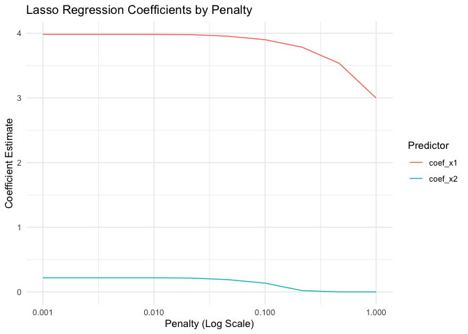

Regularization
================
Will Doyle
2026-01-13

## Lasso model

One of the key decisions for an analyst is which variables to include.
We can make decisions about this using theory, or our understanding of
the context, but we can also rely on computational approaches. This is
known as *regularization* and it involves downweighting the importance
of coefficients from a model based on the contribution that a predictor
makes. We’re going to make use of a regularization penalty known as the
“lasso.” The lasso downweights variables mostly by dropping variables
that are highly correlated with one another, leaving only one of the
correlated variables as contributors to the model. We set the degree to
which this penalty will be implemented by setting the “penalty” variable
in the model specification. (This is also called the L1 penalty, or L1
regularization)

The lasso model minimizes the RSS plus the penalty times the
coefficients, meaning the coefficients have to contribute substantially
to minimizing RSS or they’ll be quickly downweighted to 0.

$$ 
=argmin[\sum_{i=1}^{n} (y_i - \beta_0 - \sum_{j=1}^{p} x_{ij} \beta_j)^2 + \lambda \sum_{j=1}^{p} |\beta_j|]
$$

## Libraries

``` r
library(tidyverse)
```

    ## ── Attaching core tidyverse packages ──────────────────────── tidyverse 2.0.0 ──
    ## ✔ dplyr     1.1.4     ✔ readr     2.1.5
    ## ✔ forcats   1.0.0     ✔ stringr   1.6.0
    ## ✔ ggplot2   4.0.0     ✔ tibble    3.3.0
    ## ✔ lubridate 1.9.4     ✔ tidyr     1.3.1
    ## ✔ purrr     1.1.0     
    ## ── Conflicts ────────────────────────────────────────── tidyverse_conflicts() ──
    ## ✖ dplyr::filter() masks stats::filter()
    ## ✖ dplyr::lag()    masks stats::lag()
    ## ℹ Use the conflicted package (<http://conflicted.r-lib.org/>) to force all conflicts to become errors

``` r
library(tidymodels)
```

    ## ── Attaching packages ────────────────────────────────────── tidymodels 1.4.1 ──
    ## ✔ broom        1.0.10     ✔ rsample      1.3.1 
    ## ✔ dials        1.4.2      ✔ tailor       0.1.0 
    ## ✔ infer        1.0.9      ✔ tune         2.0.1 
    ## ✔ modeldata    1.5.1      ✔ workflows    1.3.0 
    ## ✔ parsnip      1.3.3      ✔ workflowsets 1.1.1 
    ## ✔ recipes      1.3.1      ✔ yardstick    1.3.2 
    ## ── Conflicts ───────────────────────────────────────── tidymodels_conflicts() ──
    ## ✖ scales::discard() masks purrr::discard()
    ## ✖ dplyr::filter()   masks stats::filter()
    ## ✖ recipes::fixed()  masks stringr::fixed()
    ## ✖ dplyr::lag()      masks stats::lag()
    ## ✖ yardstick::spec() masks readr::spec()
    ## ✖ recipes::step()   masks stats::step()

``` r
library(janitor)
```

    ## 
    ## Attaching package: 'janitor'
    ## 
    ## The following objects are masked from 'package:stats':
    ## 
    ##     chisq.test, fisher.test

## Numeric example

We’ll start by generating a large dataset with a strong predictor x1,
and a weaker predictor, x2

``` r
# Generate standardized dataset
n <- 1e6  # Number of observations
x1 <- rnorm(n, mean = 0, sd = 1)
x2 <- rnorm(n, mean = 0, sd = 1)

b1=4
b2=.25

y <- (b1 * x1) + (b2 * x2) + rnorm(n, mean = 0, sd = 5)

data <- tibble(x1 = x1, x2 = x2, y = y)
```

We’ll then split training and testing as always.

``` r
data_split <- initial_split(data, prop = 0.8)
train_data <- training(data_split)
test_data <- testing(data_split)
```

This data barely needs any preprocessing, so the recipe is simple

``` r
recipe <- recipe(y ~ x1 + x2, data = train_data)
```

Our model specification will be a bit different– we’re going to use the
`tune()` function, which implies that we’ll use different values for the
penalty (lambda in the textbook, also known as l1 regularization).

``` r
# Define model specification with tunable penalty
lasso_spec <- linear_reg(penalty = tune(), mixture = 1) %>%
  set_engine("glmnet")
```

Put those together in a workflow.

``` r
# Define a workflow
workflow <- workflow() %>%
  add_recipe(recipe) %>%
  add_model(lasso_spec)
```

When we set a tuning value, we’re saying that we’re going to supply a
set of possible values for that parameter. The code below gives a grid
with some sensible values using powers of 10 from -3 to 0. Penalty can
only be from 0-1, this gives us a good lineup.

``` r
# Grid of penalty values
penalty_values <- 10^seq(-3, 0, length.out = 10)
```

The function below uses `map_dfr` to map the penalty values onto the
function that fits the data and outputs the results as a data frame,
with the columns `predictions`, `rmse_values` and `coef_values`. The
resulting data frame is created in the tibble function. The output is
then the data frame.

``` r
# Fit models for each penalty value and collect results
results <- map_dfr(
  penalty_values,
  function(penalty_value) {
    # Fit the model on training data
    lasso_fit <- linear_reg(penalty = penalty_value, mixture = 1) %>%
      set_engine("glmnet") %>%
      fit(y ~ x1 + x2, data = train_data)

    # Get predictions on the testing data
    predictions <- predict(lasso_fit, test_data) %>%
      bind_cols(test_data)

    # Calculate RMSE
    rmse_value <- rmse(predictions, truth = y, estimate = .pred)

    # Add penalty value and coefficients
    coef_values <- tidy(lasso_fit) %>%
      filter(term != "(Intercept)") %>%
      mutate(penalty = penalty_value)

    tibble(
      penalty = penalty_value,
      rmse = rmse_value$.estimate,
      coef_x1 = coef_values$estimate[coef_values$term == "x1"],
      coef_x2 = coef_values$estimate[coef_values$term == "x2"]
    )
  }
)
```

    ## 
    ## Attaching package: 'Matrix'

    ## The following objects are masked from 'package:tidyr':
    ## 
    ##     expand, pack, unpack

    ## Loaded glmnet 4.1-10

We can then plot the results.

``` r
# Visualize RMSE and coefficients as a function of penalty
results %>%
  pivot_longer(cols = starts_with("coef"), names_to = "term", values_to = "coefficient") %>%
  ggplot(aes(x = penalty, y = coefficient, color = term)) +
  geom_line() +
  scale_x_log10() + ## So the plot is linear
  labs(
    title = "Lasso Regression Coefficients by Penalty",
    x = "Penalty (Log Scale)",
    y = "Coefficient Estimate",
    color = "Predictor"
  ) +
  theme_minimal()
```

<!-- -->

``` r
results %>%
  ggplot(aes(x = penalty, y = rmse)) +
  geom_line() +
  scale_x_log10() + 
  labs(
    title = "RMSE by Penalty",
    x = "Penalty (Log Scale)",
    y = "RMSE"
  ) +
  theme_minimal()
```

<!-- -->

As you can see, as the penalty increases at first the rmse only
decreases a bit. As it goes higher it begins downweighting even the x1
predictor too much and the rmse goes much higher.

Let’s take the lasso and apply it to our high school example, using
lasso to predict GPA.

## Load dataset

``` r
hs<-read_csv("hsls_extract.csv")%>%clean_names()
```

    ## Rows: 23503 Columns: 12
    ## ── Column specification ────────────────────────────────────────────────────────
    ## Delimiter: ","
    ## chr (9): X1PAR1EDU, X1PAR1EMP, X1HHNUMBER, X1FAMINCOME, X1STUEDEXPCT, X1IEPF...
    ## dbl (3): X1TXMTSCOR, X1SCHOOLENG, X3TGPATOT
    ## 
    ## ℹ Use `spec()` to retrieve the full column specification for this data.
    ## ℹ Specify the column types or set `show_col_types = FALSE` to quiet this message.

## Data Cleaning

``` r
hs <- hs %>%
  mutate(across(-x1txmtscor, ~ ifelse(. < 0, NA, .)))%>%
  drop_na()
```

## Training/Testing

``` r
hs_split<-initial_split(hs)

hs_train<-training(hs_split)

hs_test<-testing(hs_split)
```

## Recipe

``` r
hs_formula<-as.formula("x3tgpatot~.")

hs_rec<-recipe(hs_formula,data=hs_train)%>%
  update_role(x3tgpatot,new_role = "outcome")%>%
  step_other(all_nominal_predictors(),threshold = .01)%>%
  step_dummy(all_nominal_predictors())%>%
  step_filter_missing(all_predictors(),threshold = .1)%>%
  step_naomit(all_outcomes(),all_predictors())%>%
  step_corr(all_predictors(),threshold = .95)%>%
  step_zv(all_predictors())%>%
  step_normalize(all_predictors())
```

Now we can update the model to use lasso, which will subset on a smaller
number of covariates. In the `tidymodels` setup, ridge is alpha
(mixture)=0, while lasso is alpha (mixture)=1.
<https://parsnip.tidymodels.org/reference/glmnet-details.htm>

We’ll set a penalty of .1 just to start.

``` r
penalty_spec<-.05

mixture_spec<-1

lasso_fit<- 
  linear_reg(penalty=penalty_spec,
             mixture=mixture_spec) %>% 
  set_engine("glmnet")%>%
  set_mode("regression")
```

## Define the Workflow

``` r
hs_wf<-workflow()
```

## Add the Model

``` r
hs_wf<-hs_wf%>%
  add_model(lasso_fit)
```

Now we can add our recipe to the workflow.

``` r
hs_wf<-hs_wf%>%
  add_recipe(hs_rec)
```

And fit the data:

``` r
hs_wf<-hs_wf%>%
  fit(hs_train)
```

Using the same setup as we did with regression, we’ll ad the predictions
from the lasso model to the test dataset.

``` r
  hs_test<-augment(hs_wf,hs_test)
```

## Calculate RMSE

Next we can use the `rmse` command to compare the actual outcome in the
dataset to the outcome.

``` r
hs_test%>%
  rmse(truth=x3tgpatot,estimate=.pred)
```

    ## # A tibble: 1 × 3
    ##   .metric .estimator .estimate
    ##   <chr>   <chr>          <dbl>
    ## 1 rmse    standard       0.613

We can also look at the coefficients to get a sense of what got included
and what got dropped.

``` r
hs_wf%>%
  extract_fit_parsnip()%>%
  tidy()%>%
  arrange(-abs(estimate))%>%print(n=50)
```

    ## # A tibble: 46 × 3
    ##    term                                                    estimate penalty
    ##    <chr>                                                      <dbl>   <dbl>
    ##  1 (Intercept)                                              2.93       0.05
    ##  2 x1txmtscor                                               0.351      0.05
    ##  3 x1schooleng                                              0.0944     0.05
    ##  4 x1stuedexpct_High.school.diploma.or.GED                 -0.0440     0.05
    ##  5 x1control_Public                                        -0.0384     0.05
    ##  6 x1famincome_Unit.non.response                           -0.0269     0.05
    ##  7 x1par1edu_Bachelor.s.degree                              0.0192     0.05
    ##  8 x1famincome_Family.income.less.than.or.equal.to..15.000 -0.00735    0.05
    ##  9 x1famincome_Family.income....15.000.and.....35.000      -0.00509    0.05
    ## 10 x1par1edu_Master.s.degree                                0.00246    0.05
    ## 11 x1par1edu_High.school.diploma.or.GED                     0          0.05
    ## 12 x1par1edu_Less.than.high.school                          0          0.05
    ## 13 x1par1edu_Ph.D.M.D.Law.other.high.lvl.prof.degree        0          0.05
    ## 14 x1par1emp_P1.currently.working.PT...35.hrs.wk.           0          0.05
    ## 15 x1par1emp_P1.has.never.worked.for.pay                    0          0.05
    ## 16 x1par1emp_P1.not.currently.working.for.pay               0          0.05
    ## 17 x1hhnumber_X3.Household.members                          0          0.05
    ## 18 x1hhnumber_X4.Household.members                          0          0.05
    ## 19 x1hhnumber_X5.Household.members                          0          0.05
    ## 20 x1hhnumber_X6.Household.members                          0          0.05
    ## 21 x1hhnumber_X7.Household.members                          0          0.05
    ## 22 x1hhnumber_X8.Household.members                          0          0.05
    ## 23 x1hhnumber_other                                         0          0.05
    ## 24 x1famincome_Family.income....135.000.and.....155.000     0          0.05
    ## 25 x1famincome_Family.income....155.000.and....175.000      0          0.05
    ## 26 x1famincome_Family.income....175.000.and.....195.000     0          0.05
    ## 27 x1famincome_Family.income....195.000.and.....215.000     0          0.05
    ## 28 x1famincome_Family.income....235.000                     0          0.05
    ## 29 x1famincome_Family.income....35.000.and.....55.000       0          0.05
    ## 30 x1famincome_Family.income....55.000.and.....75.000       0          0.05
    ## 31 x1famincome_Family.income....75.000.and.....95.000       0          0.05
    ## 32 x1famincome_Family.income....95.000.and.....115.000      0          0.05
    ## 33 x1famincome_other                                        0          0.05
    ## 34 x1stuedexpct_Complete.a.Master.s.degree                  0          0.05
    ## 35 x1stuedexpct_Complete.an.Associate.s.degree              0          0.05
    ## 36 x1stuedexpct_Complete.Ph.D.M.D.Law.other.prof.degree     0          0.05
    ## 37 x1stuedexpct_Don.t.know                                  0          0.05
    ## 38 x1stuedexpct_other                                       0          0.05
    ## 39 x1iepflag_Student.has.an.IEP                             0          0.05
    ## 40 x1iepflag_Student.has.no.IEP                             0          0.05
    ## 41 x1locale_Rural                                           0          0.05
    ## 42 x1locale_Suburb                                          0          0.05
    ## 43 x1locale_Town                                            0          0.05
    ## 44 x1region_Northeast                                       0          0.05
    ## 45 x1region_South                                           0          0.05
    ## 46 x1region_West                                            0          0.05

So, whereas before we had 36 substantive coefficients, now we have four.
That’s what lasso does, particularly with a high penalty level.

## Quick Exercise

Go back and set the penalty to .01 and rerun the code. What changes in
terms of coefficient estimates and rmse?

## Quick Exercise 2

Our first kaggle challenge! Minimize the rmse using L1 regularization
and/or feature engineering.
