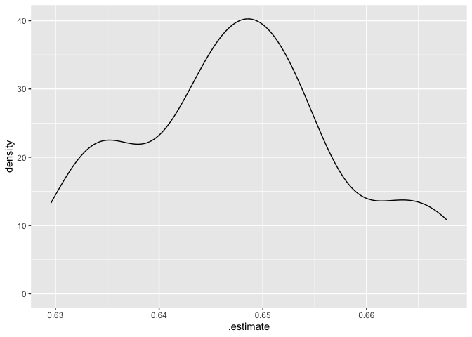

Validation and Hyperparameter Tuning
================
Will Doyle
2026-01-13

## Cross Validation

The essence of prediction is discovering the extent to which our models
can predict outcomes for data that does not come from our sample. Many
times this process is temporal. We fit a model to data from one time
period, then take predictors from a subsequent time period to come up
with a prediction in the future. For instance, we might use data on team
performance to predict the likely winners and losers for upcoming soccer
games.

This process does not have to be temporal. We can also have data that is
out of sample because it hadn’t yet been collected when our first data
was collected, or we can also have data that is out of sample because we
designated it as out of sample.

The data that is used to generate our predictions is known as *training*
data. The idea is that this is the data used to train our model, to let
it know what the relationship is between our predictors and our outcome.

That data that is used to validate our predictions is known as *testing*
data. With testing data, we take our trained model and see how good it
is at predicting outcomes using out of sample data.

One very simple approach to this would be to cut our data in two parts.
This is what we’ve done so far. We could then train our model on one
part of the data, then test it on the other part. This would tell us
whether our measure of model fit (e.g. rmse) is similar or different
when we apply our model to out of sample data.

But this would only be a “one-shot” approach. It would be better to do
this multiple times, cutting the data into two parts: , then fitting the
model to the training data, and then checking its predictions against
the validation data set. That way, we could generate a large number of
measures of accuracy to see how well the model fits on lots of different
possible out-of-sample predictions.

This process is called *cross validation*, and it involves two important
decisions: first, how will the data be cut, and second,how many times
will the validation run?

## Monte Carlo Resampling

Monte Carlo resampling is a method used in the context of
cross-validation to evaluate machine learning models. Monte Carlo
resampling involves randomly splitting the data multiple times into
*analysis* (training) and *assessment* (testing) sets, ensuring that the
evaluation of model fit in the testing dataset isn’t unduly affected by
a single “draw” of the testing data.

We’ll get everything set up for modeling in the hsls data before
structuring the data for resampling.

``` r
library(tidyverse)
```

    ## ── Attaching core tidyverse packages ──────────────────────── tidyverse 2.0.0 ──
    ## ✔ dplyr     1.1.4     ✔ readr     2.1.5
    ## ✔ forcats   1.0.0     ✔ stringr   1.6.0
    ## ✔ ggplot2   4.0.0     ✔ tibble    3.3.0
    ## ✔ lubridate 1.9.4     ✔ tidyr     1.3.1
    ## ✔ purrr     1.1.0     
    ## ── Conflicts ────────────────────────────────────────── tidyverse_conflicts() ──
    ## ✖ dplyr::filter() masks stats::filter()
    ## ✖ dplyr::lag()    masks stats::lag()
    ## ℹ Use the conflicted package (<http://conflicted.r-lib.org/>) to force all conflicts to become errors

``` r
library(tidymodels)
```

    ## ── Attaching packages ────────────────────────────────────── tidymodels 1.4.1 ──
    ## ✔ broom        1.0.10     ✔ rsample      1.3.1 
    ## ✔ dials        1.4.2      ✔ tailor       0.1.0 
    ## ✔ infer        1.0.9      ✔ tune         2.0.1 
    ## ✔ modeldata    1.5.1      ✔ workflows    1.3.0 
    ## ✔ parsnip      1.3.3      ✔ workflowsets 1.1.1 
    ## ✔ recipes      1.3.1      ✔ yardstick    1.3.2 
    ## ── Conflicts ───────────────────────────────────────── tidymodels_conflicts() ──
    ## ✖ scales::discard() masks purrr::discard()
    ## ✖ dplyr::filter()   masks stats::filter()
    ## ✖ recipes::fixed()  masks stringr::fixed()
    ## ✖ dplyr::lag()      masks stats::lag()
    ## ✖ yardstick::spec() masks readr::spec()
    ## ✖ recipes::step()   masks stats::step()

``` r
library(janitor)
```

    ## 
    ## Attaching package: 'janitor'
    ## 
    ## The following objects are masked from 'package:stats':
    ## 
    ##     chisq.test, fisher.test

## Load dataset

``` r
hs<-read_csv("hsls_extract.csv")%>%clean_names()
```

    ## Rows: 23503 Columns: 12
    ## ── Column specification ────────────────────────────────────────────────────────
    ## Delimiter: ","
    ## chr (9): X1PAR1EDU, X1PAR1EMP, X1HHNUMBER, X1FAMINCOME, X1STUEDEXPCT, X1IEPF...
    ## dbl (3): X1TXMTSCOR, X1SCHOOLENG, X3TGPATOT
    ## 
    ## ℹ Use `spec()` to retrieve the full column specification for this data.
    ## ℹ Specify the column types or set `show_col_types = FALSE` to quiet this message.

## Data Cleaning

``` r
hs <- hs %>%
  mutate(across(-x1txmtscor, ~ ifelse(. < 0, NA, .)))%>%
  drop_na()
```

``` r
hs_split<-initial_split(hs)

hs_train<-training(hs_split)

hs_test<-testing(hs_split)
```

## Recipe

``` r
hs_formula<-as.formula("x3tgpatot~.")

hs_rec<-recipe(hs_formula,data=hs_train)%>%
  update_role(x3tgpatot,new_role = "outcome")%>%
  step_other(all_nominal_predictors(),threshold = .01)%>%
  step_dummy(all_nominal_predictors())%>%
  step_filter_missing(all_predictors(),threshold = .1)%>%
  step_naomit(all_outcomes(),all_predictors())%>%
  step_zv(all_predictors())%>%
  step_normalize(all_predictors())
```

We have two values that we need to specify to set up a lasso model. The
`penalty` value sets the $\lambda$ from the above notes. The `mixture`
value sets the proportion ridge (L2) or lasso (L1). Setting mixture to 1
makes the model pure lasso.

``` r
penalty_spec<-.1

mixture_spec<-1

lasso_fit<- 
  linear_reg(penalty=penalty_spec,
             mixture=mixture_spec) %>% 
  set_engine("glmnet")%>%
  set_mode("regression")
```

The code below will generate a resampled dataset using Monte Carlo
resampling. The default is to split it 75/25, with 25 replications.

``` r
hs_rs<-mc_cv(hs_train,times=25,prop=.75) ## More like 1000 in practice
```

Set the workflow, as usual.

``` r
hs_wf<-workflow()%>%
  add_model(lasso_fit)%>%
  add_recipe(hs_rec)
```

We can then fit the model to the resampled data via `fit_resamples`.

``` r
hs_lasso_fit<-hs_wf%>%
  fit_resamples(hs_rs)
```

The model has now been fit to 25 versions of the analysis data. Let’s
look at the metrics using `collect_metrics`. This will take the
coefficients from the analysis datasets and generate predictions from
the assessment datasets.

``` r
hs_lasso_fit%>%collect_metrics()
```

    ## # A tibble: 2 × 6
    ##   .metric .estimator  mean     n std_err .config        
    ##   <chr>   <chr>      <dbl> <int>   <dbl> <chr>          
    ## 1 rmse    standard   0.644    25 0.00254 pre0_mod0_post0
    ## 2 rsq     standard   0.333    25 0.00320 pre0_mod0_post0

We can also pull certain metrics like rmse one at a time if we want.

``` r
hs_lasso_fit%>%
  unnest(.metrics)%>%
  filter(.metric=="rmse")%>%
  ggplot(aes(x=.estimate))+
  geom_density()
```

<!-- -->

## Model Tuning

The problem with the above is that I arbitrarily set the value of
penalty to be .1. Do I know this was correct? No! What we need to do is
try out a bunch of different values of the penalty, and see which one
gives us the best model fit. This process has the impressive name of
“hyperparameter tuning via cross validation” but it could just as easily
be called “trying a bunch of stuff to see what works.”

Below I’m going to give the argument `tune()` for the value of penalty.
This will allow us to “fill in” values later.

Of course we don’t know what penalty to use in the lasso model, so we
can tune it. This is set up by using the `penalty=tune()` approach
below.

``` r
hs_tune_model<- 
  linear_reg(penalty=tune(),mixture=mixture_spec)%>% 
  set_engine("glmnet")
```

Now that we’ve said which parameter to tune, we’ll use the
`grid_regular` command to get a set of nicely spaced out values. This
command is specific to the hyperparameter, so it will choose reasonable
values for the penalty hyperparameter.

``` r
lasso_grid<-grid_regular(extract_parameter_set_dials(hs_tune_model), levels=10)
```

We can use `update_model` to change our workflow with the new model.

``` r
hs_wf<-hs_wf%>%
  update_model(hs_tune_model)
```

Then we can use `tune_grid` to run the model through the resampled data,
using the grid supplied.

``` r
hs_lasso_tune_fit <- 
  hs_wf %>%
    tune_grid(hs_rs,grid=lasso_grid)
```

    ## → A | warning: A correlation computation is required, but `estimate` is constant and has 0
    ##                standard deviation, resulting in a divide by 0 error. `NA` will be returned.

    ## There were issues with some computations   A: x1There were issues with some computations   A: x2There were issues with some computations   A: x3There were issues with some computations   A: x4There were issues with some computations   A: x5There were issues with some computations   A: x6There were issues with some computations   A: x7There were issues with some computations   A: x8There were issues with some computations   A: x9There were issues with some computations   A: x10There were issues with some computations   A: x11There were issues with some computations   A: x12There were issues with some computations   A: x13There were issues with some computations   A: x14There were issues with some computations   A: x15There were issues with some computations   A: x16There were issues with some computations   A: x17There were issues with some computations   A: x18There were issues with some computations   A: x19There were issues with some computations   A: x20There were issues with some computations   A: x21There were issues with some computations   A: x22There were issues with some computations   A: x23There were issues with some computations   A: x24There were issues with some computations   A: x25There were issues with some computations   A: x25

## Examine Results

Lets’ take a look and see which models fit better.

``` r
hs_lasso_tune_fit%>%
  collect_metrics()%>%
  filter(.metric=="rmse")%>%
  arrange(mean)
```

    ## # A tibble: 10 × 7
    ##          penalty .metric .estimator  mean     n std_err .config         
    ##            <dbl> <chr>   <chr>      <dbl> <int>   <dbl> <chr>           
    ##  1 0.000464      rmse    standard   0.603    25 0.00229 pre0_mod07_post0
    ##  2 0.0000000001  rmse    standard   0.603    25 0.00229 pre0_mod01_post0
    ##  3 0.00000000129 rmse    standard   0.603    25 0.00229 pre0_mod02_post0
    ##  4 0.0000000167  rmse    standard   0.603    25 0.00229 pre0_mod03_post0
    ##  5 0.000000215   rmse    standard   0.603    25 0.00229 pre0_mod04_post0
    ##  6 0.00000278    rmse    standard   0.603    25 0.00229 pre0_mod05_post0
    ##  7 0.0000359     rmse    standard   0.603    25 0.00229 pre0_mod06_post0
    ##  8 0.00599       rmse    standard   0.603    25 0.00229 pre0_mod08_post0
    ##  9 0.0774        rmse    standard   0.634    25 0.00257 pre0_mod09_post0
    ## 10 1             rmse    standard   0.777    25 0.00233 pre0_mod10_post0

## Completing the workflow

Once we’ve identified the hyperparameter that has the lowest mean and SE
in the rmse, the next step is to finalize the workflow using that
hyperparameter.

First, we’ll pull the best parameters.

``` r
best_params <- hs_lasso_tune_fit %>%
  select_best(metric = "rmse") 
```

Next, we’ll finalize the workflow using those parameters.

``` r
final_lasso_workflow <- hs_wf %>%
  finalize_workflow(best_params)
```

And then we’ll fit the model to the full training dataset.

``` r
final_model <- final_lasso_workflow %>%
  fit(data = hs_train) 
```

``` r
predictions <- final_model %>%
  predict(new_data = hs_test) %>% 
  bind_cols(hs_test) 
```

``` r
predictions%>%  
metrics(truth = x3tgpatot, estimate = .pred)
```

    ## # A tibble: 3 × 3
    ##   .metric .estimator .estimate
    ##   <chr>   <chr>          <dbl>
    ## 1 rmse    standard       0.615
    ## 2 rsq     standard       0.387
    ## 3 mae     standard       0.479

This represents a completed workflow– the parameters are set, and the
model is deployable.

## K-fold Cross Validation

K-fold cross-validation is a widely used method to evaluate and tune
machine learning models by splitting the dataset into k equally sized
subsets (folds). It systematically rotates the roles of training and
testing datasets to provide robust performance estimates.

How It Works. First, we partition the data:

The dataset is randomly divided into k equal (or nearly equal) folds.
Each fold serves as the testing dataset once, while the remaining k−1
folds are combined to form the training dataset.

Model Training and Evaluation:

For each fold: - The model is trained on the aggregated k−1 folds
(*analysis* (training) set). - The model is tested on the left-out fold
(*assessment* (testing) set). - The performance metric (e.g., RMSE,
accuracy, is calculated on the assessment set. - This process is
repeated k times (once for each fold).

Aggregating Results:

The evaluation metrics from all k iterations are averaged to produce a
single performance estimate. This reduces the risk of biased evaluations
due to a single train-test split.

To structure the data for k-fold resampling, we use the `vfold_cv`
command. Here we’ll do 20 folds:

``` r
hs_vf<-vfold_cv(hs_train,v = 20)
```

And then we can add the new tuning grid to our workflow.

``` r
hs_lasso_tune_fit <- 
  hs_wf %>%
    tune_grid(hs_vf,grid=lasso_grid)
```

    ## → A | warning: A correlation computation is required, but `estimate` is constant and has 0
    ##                standard deviation, resulting in a divide by 0 error. `NA` will be returned.

    ## There were issues with some computations   A: x1There were issues with some computations   A: x2There were issues with some computations   A: x3There were issues with some computations   A: x4There were issues with some computations   A: x5There were issues with some computations   A: x6There were issues with some computations   A: x7There were issues with some computations   A: x8There were issues with some computations   A: x9There were issues with some computations   A: x10There were issues with some computations   A: x11There were issues with some computations   A: x12There were issues with some computations   A: x13There were issues with some computations   A: x14There were issues with some computations   A: x15There were issues with some computations   A: x16There were issues with some computations   A: x17There were issues with some computations   A: x18There were issues with some computations   A: x19There were issues with some computations   A: x20There were issues with some computations   A: x20

## Examine Results

Lets’ take a look and see which models fit better using the k-fold
approach.

``` r
hs_lasso_tune_fit%>%
  collect_metrics()%>%
  filter(.metric=="rmse")%>%
  arrange(mean)
```

    ## # A tibble: 10 × 7
    ##          penalty .metric .estimator  mean     n std_err .config         
    ##            <dbl> <chr>   <chr>      <dbl> <int>   <dbl> <chr>           
    ##  1 0.000464      rmse    standard   0.602    20 0.00612 pre0_mod07_post0
    ##  2 0.0000000001  rmse    standard   0.602    20 0.00613 pre0_mod01_post0
    ##  3 0.00000000129 rmse    standard   0.602    20 0.00613 pre0_mod02_post0
    ##  4 0.0000000167  rmse    standard   0.602    20 0.00613 pre0_mod03_post0
    ##  5 0.000000215   rmse    standard   0.602    20 0.00613 pre0_mod04_post0
    ##  6 0.00000278    rmse    standard   0.602    20 0.00613 pre0_mod05_post0
    ##  7 0.0000359     rmse    standard   0.602    20 0.00613 pre0_mod06_post0
    ##  8 0.00599       rmse    standard   0.603    20 0.00609 pre0_mod08_post0
    ##  9 0.0774        rmse    standard   0.633    20 0.00613 pre0_mod09_post0
    ## 10 1             rmse    standard   0.776    20 0.00671 pre0_mod10_post0

## Ridge Regression

Ridge regression is another technique for regularization, which helps to
solve the multicollinearity problem by adding a degree of bias to the
regression estimates. It includes every predictor in the model but
shrinks the coefficients of less important predictors towards zero, thus
minimizing their impact on the model.

In the tidymodels setup, ridge is specified with mixture=0 and penalty
set to the desired value. A value of mixture = 1 corresponds to a pure
lasso model, while mixture = 0 indicates ridge regression. Values of
mixture in between will set the balance between the two in the elastic
net model, which we’ll cover shortly.

The code below runs through what should be a familiar set of steps to
tune a ridge regression.

``` r
mixture_spec=0
hs_tune_model<- 
  linear_reg(penalty=tune(),mixture=mixture_spec)%>% 
  set_engine("glmnet")
```

``` r
ridge_grid<-grid_regular(extract_parameter_set_dials(hs_tune_model) ,levels=10)
```

``` r
hs_wf<-hs_wf%>%
  update_model(hs_tune_model)
```

``` r
hs_ridge_tune_fit <- 
  hs_wf %>%
    tune_grid(hs_rs,grid=ridge_grid)
```

We examine the rmse from the cross validated ridge regression here.

``` r
hs_ridge_tune_fit%>%
  collect_metrics()%>%
  filter(.metric=="rmse")%>%
  arrange(mean)
```

    ## # A tibble: 10 × 7
    ##          penalty .metric .estimator  mean     n std_err .config         
    ##            <dbl> <chr>   <chr>      <dbl> <int>   <dbl> <chr>           
    ##  1 0.0000000001  rmse    standard   0.603    25 0.00227 pre0_mod01_post0
    ##  2 0.00000000129 rmse    standard   0.603    25 0.00227 pre0_mod02_post0
    ##  3 0.0000000167  rmse    standard   0.603    25 0.00227 pre0_mod03_post0
    ##  4 0.000000215   rmse    standard   0.603    25 0.00227 pre0_mod04_post0
    ##  5 0.00000278    rmse    standard   0.603    25 0.00227 pre0_mod05_post0
    ##  6 0.0000359     rmse    standard   0.603    25 0.00227 pre0_mod06_post0
    ##  7 0.000464      rmse    standard   0.603    25 0.00227 pre0_mod07_post0
    ##  8 0.00599       rmse    standard   0.603    25 0.00227 pre0_mod08_post0
    ##  9 0.0774        rmse    standard   0.604    25 0.00227 pre0_mod09_post0
    ## 10 1             rmse    standard   0.639    25 0.00233 pre0_mod10_post0

And as always, select the best model fit.

``` r
best_ridge_penalty<-select_best(hs_ridge_tune_fit)
```

    ## Warning in select_best(hs_ridge_tune_fit): No value of `metric` was given;
    ## "rmse" will be used.

``` r
best_ridge_penalty<-best_ridge_penalty$penalty[1]

hs_tune_model<- 
  linear_reg(penalty=best_ridge_penalty,mixture=mixture_spec)%>% 
  set_engine("glmnet")

hs_ridge_result<-hs_wf%>%
  update_model(hs_tune_model)%>%
  fit(hs_train)
```

Examining the coefficients for a ridge regression shows how they’re more
likely to be “downweighted” as opposed to set to 0 as in lasso,
particularly in this case where very low values for the penalty are
favored.

``` r
hs_ridge_result%>%extract_fit_parsnip()%>%tidy()%>%
  arrange(-abs(estimate))%>%print(n=50)
```

    ## 
    ## Attaching package: 'Matrix'

    ## The following objects are masked from 'package:tidyr':
    ## 
    ##     expand, pack, unpack

    ## Loaded glmnet 4.1-10

    ## # A tibble: 49 × 3
    ##    term                                                     estimate     penalty
    ##    <chr>                                                       <dbl>       <dbl>
    ##  1 (Intercept)                                              2.93           1e-10
    ##  2 x1txmtscor                                               0.320          1e-10
    ##  3 x1schooleng                                              0.115          1e-10
    ##  4 x1stuedexpct_High.school.diploma.or.GED                 -0.0757         1e-10
    ##  5 x1control_Public                                        -0.0645         1e-10
    ##  6 x1famincome_Family.income....15.000.and.....35.000      -0.0525         1e-10
    ##  7 x1famincome_Family.income.less.than.or.equal.to..15.000 -0.0481         1e-10
    ##  8 x1locale_Rural                                           0.0470         1e-10
    ##  9 x1hhnumber_X4.Household.members                          0.0420         1e-10
    ## 10 x1region_South                                          -0.0333         1e-10
    ## 11 x1par1edu_Bachelor.s.degree                              0.0325         1e-10
    ## 12 x1locale_Town                                            0.0316         1e-10
    ## 13 x1stuedexpct_Complete.an.Associate.s.degree             -0.0311         1e-10
    ## 14 x1par1edu_Master.s.degree                                0.0276         1e-10
    ## 15 x1region_Northeast                                      -0.0264         1e-10
    ## 16 x1stuedexpct_Complete.a.Master.s.degree                  0.0263         1e-10
    ## 17 x1stuedexpct_Don.t.know                                 -0.0245         1e-10
    ## 18 x1stuedexpct_other                                      -0.0243         1e-10
    ## 19 x1hhnumber_X5.Household.members                          0.0216         1e-10
    ## 20 x1hhnumber_X6.Household.members                          0.0196         1e-10
    ## 21 x1par1emp_P1.currently.working.PT...35.hrs.wk.           0.0189         1e-10
    ## 22 x1par1edu_Less.than.high.school                         -0.0177         1e-10
    ## 23 x1hhnumber_X8.Household.members                          0.0166         1e-10
    ## 24 x1famincome_Unit.non.response                           -0.0158         1e-10
    ## 25 x1par1emp_Unit.non.response                             -0.0153         1e-10
    ## 26 x1iepflag_Student.has.no.IEP                             0.0151         1e-10
    ## 27 x1par1edu_Unit.non.response                             -0.0150         1e-10
    ## 28 x1famincome_Family.income....35.000.and.....55.000      -0.0149         1e-10
    ## 29 x1par1edu_High.school.diploma.or.GED                    -0.0145         1e-10
    ## 30 x1par1emp_P1.not.currently.working.for.pay              -0.0145         1e-10
    ## 31 x1hhnumber_X3.Household.members                          0.0144         1e-10
    ## 32 x1hhnumber_Unit.non.response                            -0.0128         1e-10
    ## 33 x1par1edu_Ph.D.M.D.Law.other.high.lvl.prof.degree        0.0126         1e-10
    ## 34 x1stuedexpct_Complete.Ph.D.M.D.Law.other.prof.degree     0.0118         1e-10
    ## 35 x1famincome_Family.income....95.000.and.....115.000      0.0101         1e-10
    ## 36 x1famincome_Family.income....135.000.and.....155.000     0.00963        1e-10
    ## 37 x1region_West                                           -0.00943        1e-10
    ## 38 x1hhnumber_X7.Household.members                          0.00929        1e-10
    ## 39 x1par1emp_P1.has.never.worked.for.pay                   -0.00621        1e-10
    ## 40 x1famincome_Family.income....155.000.and....175.000      0.00569        1e-10
    ## 41 x1hhnumber_other                                        -0.00566        1e-10
    ## 42 x1famincome_Family.income....195.000.and.....215.000     0.00454        1e-10
    ## 43 x1famincome_Family.income....75.000.and.....95.000       0.00395        1e-10
    ## 44 x1famincome_Family.income....235.000                     0.00329        1e-10
    ## 45 x1locale_Suburb                                          0.00317        1e-10
    ## 46 x1famincome_Family.income....55.000.and.....75.000       0.00266        1e-10
    ## 47 x1iepflag_Student.has.an.IEP                             0.00191        1e-10
    ## 48 x1famincome_Family.income....175.000.and.....195.000    -0.00159        1e-10
    ## 49 x1famincome_other                                       -0.000488       1e-10
