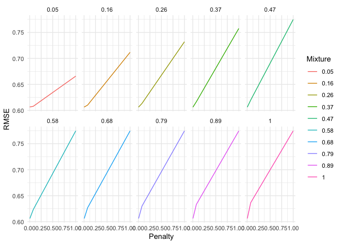

Validation and Hyperparameter Tuning
================
Will Doyle
2025-01-09

## Elastic Net

The elastic net model combines the lasso and the ridge using the mixture
parameter.

### Elastic Net: Mathematical Formulation

Elastic Net combines **L1 regularization** (Lasso) and **L2
regularization** (Ridge) into a single model. The objective function
minimizes:

$$
\text{Minimize: } \underbrace{\frac{1}{2n} \sum_{i=1}^n (y_i - \hat{y}_i)^2}_{\text{OLS loss}} + \lambda \left( \underbrace{\frac{1-\alpha}{2} \sum_{j=1}^p \beta_j^2}_{\text{L2 penalty}} + \underbrace{\alpha \sum_{j=1}^p |\beta_j|}_{\text{L1 penalty}} \right)
$$

- $\lambda$ (penalty): Controls the **overall strength** of
  regularization. Larger $\lambda$ shrinks coefficients more
  aggressively.
- $\alpha$ (mixture): Determines the **blend** between L1 and L2
  penalties:
  - $\alpha = 0$: Pure Ridge (L2 penalty only)
  - $\alpha = 1$: Pure Lasso (L1 penalty only)
  - $0 < \alpha < 1$: Elastic Net (mix of both penalties).

``` r
library(tidyverse)
```

    ## ── Attaching core tidyverse packages ──────────────────────── tidyverse 2.0.0 ──
    ## ✔ dplyr     1.1.4     ✔ readr     2.1.5
    ## ✔ forcats   1.0.0     ✔ stringr   1.5.1
    ## ✔ ggplot2   3.5.1     ✔ tibble    3.2.1
    ## ✔ lubridate 1.9.3     ✔ tidyr     1.3.1
    ## ✔ purrr     1.0.2     
    ## ── Conflicts ────────────────────────────────────────── tidyverse_conflicts() ──
    ## ✖ dplyr::filter() masks stats::filter()
    ## ✖ dplyr::lag()    masks stats::lag()
    ## ℹ Use the conflicted package (<http://conflicted.r-lib.org/>) to force all conflicts to become errors

``` r
library(tidymodels)
```

    ## ── Attaching packages ────────────────────────────────────── tidymodels 1.2.0 ──
    ## ✔ broom        1.0.6     ✔ rsample      1.2.1
    ## ✔ dials        1.3.0     ✔ tune         1.2.1
    ## ✔ infer        1.0.7     ✔ workflows    1.1.4
    ## ✔ modeldata    1.4.0     ✔ workflowsets 1.1.0
    ## ✔ parsnip      1.2.1     ✔ yardstick    1.3.1
    ## ✔ recipes      1.1.0     
    ## ── Conflicts ───────────────────────────────────────── tidymodels_conflicts() ──
    ## ✖ scales::discard() masks purrr::discard()
    ## ✖ dplyr::filter()   masks stats::filter()
    ## ✖ recipes::fixed()  masks stringr::fixed()
    ## ✖ dplyr::lag()      masks stats::lag()
    ## ✖ yardstick::spec() masks readr::spec()
    ## ✖ recipes::step()   masks stats::step()
    ## • Learn how to get started at https://www.tidymodels.org/start/

``` r
library(janitor)
```

    ## 
    ## Attaching package: 'janitor'
    ## 
    ## The following objects are masked from 'package:stats':
    ## 
    ##     chisq.test, fisher.test

## Load dataset

``` r
hs<-read_csv("hsls_extract.csv")%>%clean_names()
```

    ## Rows: 23503 Columns: 12
    ## ── Column specification ────────────────────────────────────────────────────────
    ## Delimiter: ","
    ## chr (9): X1PAR1EDU, X1PAR1EMP, X1HHNUMBER, X1FAMINCOME, X1STUEDEXPCT, X1IEPF...
    ## dbl (3): X1TXMTSCOR, X1SCHOOLENG, X3TGPATOT
    ## 
    ## ℹ Use `spec()` to retrieve the full column specification for this data.
    ## ℹ Specify the column types or set `show_col_types = FALSE` to quiet this message.

## Data Cleaning

``` r
hs <- hs %>%
  mutate(across(-x1txmtscor, ~ ifelse(. < 0, NA, .)))%>%
  drop_na()
```

``` r
hs_split<-initial_split(hs)

hs_train<-training(hs_split)

hs_test<-testing(hs_split)
```

## Recipe

``` r
hs_formula<-as.formula("x3tgpatot~.")

hs_rec<-recipe(hs_formula,data=hs_train)%>%
  update_role(x3tgpatot,new_role = "outcome")%>%
  step_other(all_nominal_predictors(),threshold = .01)%>%
  step_dummy(all_nominal_predictors())%>%
  step_zv(all_predictors())%>%
  step_normalize(all_predictors())
```

In tidymodels, elastic net is set using two paramters. Penalty sets
$\lambda$ while mixture sets $\alpha$ in the above notation. Below,
we’ll just set these as two values that need to be tuned.

``` r
hs_tune_model<- 
  linear_reg(penalty=tune(),mixture=tune())%>% 
  set_engine("glmnet")
```

We can use tidymodels defaults to set values for penalty and mixture.
Note how penalty goes on a log scale, while mixture just goes through
the steps from 0 to 1 in a sensible manner.

``` r
enet_grid<-grid_regular(extract_parameter_set_dials(hs_tune_model) ,levels=10)
```

``` r
hs_rs<-mc_cv(hs_train,times=25,prop=.75) ## More like 1000 in practice
```

Set the workflow, as usual.

``` r
hs_wf<-workflow()%>%
  add_model(hs_tune_model)%>%
  add_recipe(hs_rec)
```

Then we can use `tune_grid` to run the model through the resampled data,
using the grid supplied.

``` r
hs_enet_tune_fit <- 
  hs_wf %>%
    tune_grid(hs_rs,grid=enet_grid)
```

    ## → A | warning: A correlation computation is required, but `estimate` is constant and has 0
    ##                standard deviation, resulting in a divide by 0 error. `NA` will be returned.

    ## There were issues with some computations   A: x1There were issues with some computations   A: x2There were issues with some computations   A: x3There were issues with some computations   A: x4There were issues with some computations   A: x5There were issues with some computations   A: x6There were issues with some computations   A: x7There were issues with some computations   A: x8There were issues with some computations   A: x9There were issues with some computations   A: x10There were issues with some computations   A: x11There were issues with some computations   A: x12There were issues with some computations   A: x13There were issues with some computations   A: x14There were issues with some computations   A: x15There were issues with some computations   A: x16There were issues with some computations   A: x17There were issues with some computations   A: x18There were issues with some computations   A: x19There were issues with some computations   A: x20There were issues with some computations   A: x21There were issues with some computations   A: x22There were issues with some computations   A: x23There were issues with some computations   A: x24There were issues with some computations   A: x25There were issues with some computations   A: x25

Let’s take a look at the results to see which combination of penalty and
mixture seemed to work best.

``` r
hs_enet_tune_fit%>%collect_metrics()%>% filter(.metric=="rmse")%>%arrange(mean)
```

    ## # A tibble: 100 × 8
    ##          penalty mixture .metric .estimator  mean     n std_err .config         
    ##            <dbl>   <dbl> <chr>   <chr>      <dbl> <int>   <dbl> <chr>           
    ##  1 0.00599         0.156 rmse    standard   0.607    25 0.00184 Preprocessor1_M…
    ##  2 0.00599         0.05  rmse    standard   0.607    25 0.00183 Preprocessor1_M…
    ##  3 0.000464        1     rmse    standard   0.607    25 0.00183 Preprocessor1_M…
    ##  4 0.000464        0.894 rmse    standard   0.607    25 0.00183 Preprocessor1_M…
    ##  5 0.000464        0.789 rmse    standard   0.607    25 0.00183 Preprocessor1_M…
    ##  6 0.00599         0.261 rmse    standard   0.607    25 0.00185 Preprocessor1_M…
    ##  7 0.000464        0.683 rmse    standard   0.607    25 0.00183 Preprocessor1_M…
    ##  8 0.000464        0.578 rmse    standard   0.607    25 0.00183 Preprocessor1_M…
    ##  9 0.0000000001    0.472 rmse    standard   0.607    25 0.00183 Preprocessor1_M…
    ## 10 0.00000000129   0.472 rmse    standard   0.607    25 0.00183 Preprocessor1_M…
    ## # ℹ 90 more rows

We can also plot the results.

``` r
hs_enet_tune_fit%>%
collect_metrics()%>%
  mutate(mixture=as_factor(round(mixture,2)))%>%
  filter(.metric=="rmse")%>%
  rename_with(~str_to_title(.))%>%
  rename(RMSE=Mean)%>%
  ggplot(aes(y=RMSE,x=Penalty,color=Mixture))+
  geom_line()+
  facet_wrap(~Mixture,nrow=2)+
  theme_minimal()
```

<!-- -->

## Selecting best parameters

Our workflow will be much the same as last time once we’ve identified
the best parameters. The `select_best` will pull the values from the
tuning process with best mean rmse.

``` r
best_params<-select_best(hs_enet_tune_fit)
```

    ## Warning in select_best(hs_enet_tune_fit): No value of `metric` was given;
    ## "rmse" will be used.

## Finalizing the workflow

We can then take those best parameters and plug them in as the values to
be used in fitting to the full training data.

``` r
final_enet_workflow <- hs_wf %>%
  finalize_workflow(best_params)
```

## Fitting to the full training data

And finally we can fit the model to get the values for the coefficients.

``` r
final_model <- final_enet_workflow %>%
  fit(data = hs_train)
```

## Variable importance

Below we can take a look at the coefficient estimates from the model
fitted on the full training dataset.

``` r
final_model%>%extract_fit_parsnip()%>%tidy()%>%arrange(-estimate)
```

    ## # A tibble: 51 × 3
    ##    term                            estimate penalty
    ##    <chr>                              <dbl>   <dbl>
    ##  1 (Intercept)                       2.94   0.00599
    ##  2 x1txmtscor                        0.340  0.00599
    ##  3 x1schooleng                       0.118  0.00599
    ##  4 x1locale_Rural                    0.0566 0.00599
    ##  5 x1hhnumber_X4.Household.members   0.0475 0.00599
    ##  6 x1par1edu_Bachelor.s.degree       0.0373 0.00599
    ##  7 x1locale_Town                     0.0322 0.00599
    ##  8 x1hhnumber_X6.Household.members   0.0295 0.00599
    ##  9 x1hhnumber_X5.Household.members   0.0289 0.00599
    ## 10 x1par1edu_Master.s.degree         0.0271 0.00599
    ## # ℹ 41 more rows

## Check against testing data

We’re now ready for the final check against the testing data.

``` r
predictions <- final_model %>%
  predict(new_data = hs_test) %>% 
  bind_cols(hs_test) 
```

``` r
predictions%>%  
metrics(truth = x3tgpatot, estimate = .pred)
```

    ## # A tibble: 3 × 3
    ##   .metric .estimator .estimate
    ##   <chr>   <chr>          <dbl>
    ## 1 rmse    standard       0.607
    ## 2 rsq     standard       0.407
    ## 3 mae     standard       0.475

## Last thoughts

While we teach ridge and lasso separately, there’s really no reason not
to use elastic net and just sort out the appropriate balance of the two
by tuning the mixture.

Make sure you’re clear on the difference between the structural
parameter estimates we’re used to thinking about in psychometrics of
econometrics and the variable importance we’re using here. It comes down
to predictive thinking versus measurement/evaluation thinking.
