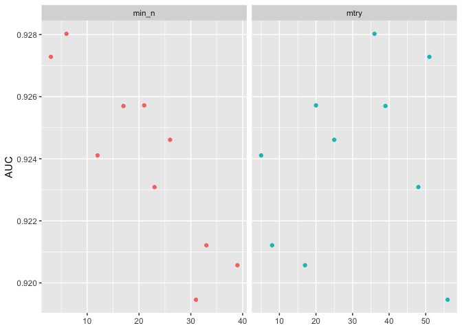

Random Forests
================
Will Doyle
2025-02-11

``` r
library(tidyverse)
```

    ## ── Attaching core tidyverse packages ──────────────────────── tidyverse 2.0.0 ──
    ## ✔ dplyr     1.1.4     ✔ readr     2.1.5
    ## ✔ forcats   1.0.0     ✔ stringr   1.5.1
    ## ✔ ggplot2   3.5.1     ✔ tibble    3.2.1
    ## ✔ lubridate 1.9.3     ✔ tidyr     1.3.1
    ## ✔ purrr     1.0.2     
    ## ── Conflicts ────────────────────────────────────────── tidyverse_conflicts() ──
    ## ✖ dplyr::filter() masks stats::filter()
    ## ✖ dplyr::lag()    masks stats::lag()
    ## ℹ Use the conflicted package (<http://conflicted.r-lib.org/>) to force all conflicts to become errors

``` r
library(tidymodels)
```

    ## ── Attaching packages ────────────────────────────────────── tidymodels 1.2.0 ──
    ## ✔ broom        1.0.6     ✔ rsample      1.2.1
    ## ✔ dials        1.3.0     ✔ tune         1.2.1
    ## ✔ infer        1.0.7     ✔ workflows    1.1.4
    ## ✔ modeldata    1.4.0     ✔ workflowsets 1.1.0
    ## ✔ parsnip      1.2.1     ✔ yardstick    1.3.1
    ## ✔ recipes      1.1.0     
    ## ── Conflicts ───────────────────────────────────────── tidymodels_conflicts() ──
    ## ✖ scales::discard() masks purrr::discard()
    ## ✖ dplyr::filter()   masks stats::filter()
    ## ✖ recipes::fixed()  masks stringr::fixed()
    ## ✖ dplyr::lag()      masks stats::lag()
    ## ✖ yardstick::spec() masks readr::spec()
    ## ✖ recipes::step()   masks stats::step()
    ## • Dig deeper into tidy modeling with R at https://www.tmwr.org

``` r
library(finetune)
library(janitor)
```

    ## 
    ## Attaching package: 'janitor'
    ## 
    ## The following objects are masked from 'package:stats':
    ## 
    ##     chisq.test, fisher.test

``` r
ou<-read_csv("oulad.csv")%>%
  mutate(result=fct_relevel(as_factor(result),c("passed","not_passed")))%>%
  select(-final_result)
```

    ## Warning: One or more parsing issues, call `problems()` on your data frame for details,
    ## e.g.:
    ##   dat <- vroom(...)
    ##   problems(dat)

    ## Rows: 32593 Columns: 33
    ## ── Column specification ────────────────────────────────────────────────────────
    ## Delimiter: ","
    ## chr (10): code_module, code_presentation, gender, region, highest_education,...
    ## dbl (22): id_student, num_of_prev_attempts, studied_credits, forumng, homepa...
    ## lgl  (1): repeatactivity
    ## 
    ## ℹ Use `spec()` to retrieve the full column specification for this data.
    ## ℹ Specify the column types or set `show_col_types = FALSE` to quiet this message.

``` r
ou_split<-initial_split(ou)

ou_train<-training(ou_split)

ou_test<-testing(ou_split)
```

## Formula and Recipe, same as last time

``` r
rf_formula<-as.formula("result~.")
```

``` r
ou_rec<-recipe(rf_formula,ou_train)%>%
  update_role(result,new_role = "outcome")%>%
  step_other(all_nominal_predictors(),threshold = .05)%>%
  step_unknown(all_nominal_predictors())%>%
  step_dummy(all_nominal_predictors())%>%
  step_zv(all_predictors())
```

## Random Forest Specification

A random forest extends the logic of a decision tree, by taking
advantage of the ability to (a) resample the data and (b) sample only a
small number of the variables for a given tree. The result is an
ensemble model– a “forest” made up of a large number of trees. The
forest then takes incoming data and “votes” on its most likely
classification. Here’s a step-by-step explanation.

1.  A bootstrap resample is created. As a quick review, a bootstrap
    sample is a sample that is the same size as the original dataset,
    but is created by randomly sampling with replacement from the
    existing dataset. In practice, this means repeating some
    observations and dropping some other observations randomly.

2.  For the first node in the first tree, a random selection of
    variables is chosen, and then the standard decision tree approach is
    used to split the data into the next nodes. The number of random
    variables to choose from is the `mtry` or “variables to try”
    hyperparameter for these models. At the next nodes, the algorithm
    again chooses a random subset of variables and again splits.

3.  The algorithm continues until it has no further splits or it reaches
    a stopping point set by the hyperparameter minimum node size, or
    `min_n`.

4.  This process is repeated for any number of trees that you might want
    to specify. This is another hyperparameter, but is most often not
    tuned, but set to 1,000.

This then is the list of tuneable parameters for random forests:

1.  Number of trees (rarely tuned):  
2.  Number of variables
3.  Minimum N per node

## Voting Rules

The model creates a number of trees equal to however many were specified
by the analyst. When assessment or testing data is used, each tree
“votes” for a class prediction. The prediction with the most number of
votes becomes the predicted label for that case. In the case of
regression, the predicted value is the average of the predictions from
all of the trees.

Error rates for these models can be calculated using out-of-bag (OOB)
samples. The out of bag sample is the excluded portion of the data from
In that case, after each tree is built, the OOB sample is used to assess
the accuracy of that specific tree by predicting outcomes for these
excluded observations. This process is repeated for all trees, and the
OOB error is computed as the average prediction error across all OOB
samples. Instead of this we’ll follow our normal procedure of cross
validation, in this case using k-fold cross validation with 10 folds
(the default).

``` r
rf_spec <- rand_forest(
  mtry = tune(),
  trees = 100, 
  min_n = tune()
) %>%
  set_mode("classification") %>%
  set_engine("ranger")
```

Here I create a very basic grid to work through.

``` r
ou_grid<-grid_regular( mtry(range = c(18, 20)), ## Should be wider range
  min_n(range = c(15, 17)), ## Should be wider range
  levels = 3)
```

## Specify Workflow

``` r
ou_wf <- workflow() %>%
  add_recipe(ou_rec) %>%
  add_model(rf_spec)
```

``` r
ou_rs<-ou%>%vfold_cv()
```

## Fit Model

``` r
fit_model<-FALSE

if(fit_model){
rf_tune_res <- tune_grid(
  ou_wf,
  ou_grid,
  resamples = ou_rs,
)
save(rf_tune_res,file="rf_tune_res.Rdata")
} else{
  load("rf_tune_res.Rdata")
}
```

## Check Model Fit

``` r
rf_tune_res %>%
  collect_metrics() %>%
  filter(.metric == "roc_auc") %>%
  select(mean, min_n, mtry) %>%
  pivot_longer(min_n:mtry,
    values_to = "value",
    names_to = "parameter"
  ) %>%
  ggplot(aes(value, mean, color = parameter)) +
  geom_point(show.legend = FALSE) +
  facet_wrap(~parameter, scales = "free_x") +
  labs(x = NULL, y = "AUC")
```

<!-- -->

## Finalize

``` r
best_auc <- select_best(rf_tune_res,metric = "roc_auc")

final_rf <- finalize_model(
  rf_spec,
  best_auc
)

final_rf
```

    ## Random Forest Model Specification (classification)
    ## 
    ## Main Arguments:
    ##   mtry = 36
    ##   trees = 100
    ##   min_n = 6
    ## 
    ## Computational engine: ranger

## Fit Best Model To Training Data, Check Against Testing

When applied to the testing data, the ensemble of trees will again parse
the datasets tree-by-tree and come up with a predicted label based on
the highest vote among the trees. This label will be used to calculate
accuracy of the model.

``` r
final_wf <- workflow() %>%
  add_recipe(ou_rec) %>%
  add_model(final_rf)

final_res <- final_wf %>%
  last_fit(ou_split)

final_res %>%
  collect_metrics()
```

    ## # A tibble: 3 × 4
    ##   .metric     .estimator .estimate .config             
    ##   <chr>       <chr>          <dbl> <chr>               
    ## 1 accuracy    binary         0.862 Preprocessor1_Model1
    ## 2 roc_auc     binary         0.929 Preprocessor1_Model1
    ## 3 brier_class binary         0.103 Preprocessor1_Model1
