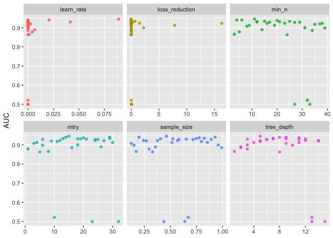
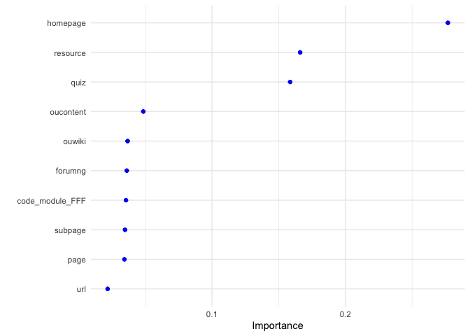

Xgboost
================
Will Doyle
2025-02-18

# Extreme Gradient Boosting (XGBoost) and Tree-Based Ensembles

XGBoost (Extreme Gradient Boosting) builds upon traditional gradient
boosting by making the process faster, more efficient, and better at
generalizing to new data. It introduces several innovations designed to
overcome the weaknesses of standard gradient boosting:

Second-Order Optimization: Instead of just using the gradient of the
loss function (which tells how much to adjust predictions), XGBoost also
incorporates the second derivative (Hessian) to improve learning
efficiency. This allows it to make better-informed adjustments at each
step.

Feature Subsampling: Inspired by random forests, XGBoost randomly
selects a subset of features at each split in a tree, reducing
correlation between individual trees and improving overall model
generalization.

Efficient Tree Construction: Traditional gradient boosting builds trees
sequentially, evaluating many possible splits, which can be slow.
XGBoost optimizes this process by using a technique called weighted
quantile sketching, allowing it to handle very large datasets
efficiently.

Handling Missing Data: Unlike many other models that require explicit
imputation, XGBoost can learn the best direction to go when encountering
missing values, improving robustness.

Together, these enhancements make XGBoost one of the most powerful
machine learning techniques, widely used in applications ranging from
finance to healthcare to competitive data science challenges. By
combining gradient boosting’s sequential refinement of predictions with
efficient, regularized tree-building techniques, XGBoost delivers high
accuracy while maintaining computational efficiency.

### Weighted Quantile Sketching in XGBoost

**Understanding the Challenge:** In traditional decision tree
algorithms, finding the best split for a feature requires sorting all
data points to identify threshold values. This process can be
computationally expensive, especially for large datasets with continuous
features. XGBoost addresses this challenge by using a method called
**weighted quantile sketching**.

**What is Quantile Sketching?** Quantile sketching is a technique used
to approximate the distribution of data efficiently. Instead of sorting
the entire dataset (which can be slow and memory-intensive), the
algorithm estimates key quantiles—like medians or percentiles—that
represent the data’s distribution. This approximation is particularly
useful for finding the best split points in decision trees.

**The “Weighted” Aspect:** In XGBoost, data points can have different
importance or weights, especially when correcting errors in boosting
iterations. Weighted quantile sketching takes these weights into
account, ensuring that the approximation reflects the actual influence
of each data point. For example, data points with higher weights (often
those with higher errors) will have more impact on determining the
quantiles.

**How It Works in XGBoost:** 1. **Summarizing Data:** The algorithm
summarizes feature values into a compact set of representative
quantiles. This summary captures the distribution without needing to
sort all data points.

2.  **Approximate Splitting:** Instead of evaluating every possible
    threshold, XGBoost uses these quantiles to approximate the best
    splits quickly. This allows it to efficiently handle large datasets
    and high-cardinality features.

3.  **Precision Control:** XGBoost ensures that the approximation is
    within a controllable error bound. This means it balances speed with
    accuracy, providing high-quality splits without excessive
    computational cost.

**Benefits of Weighted Quantile Sketching:** - **Scalability:** It
enables XGBoost to handle massive datasets with millions of data points
and features. - **Efficiency:** Reduces the time complexity of finding
optimal splits, especially for continuous variables. - **Robustness:**
Accurately reflects the distribution of data, even when some points have
higher significance due to their errors.

**Practical Impact:** This innovation is one of the reasons why XGBoost
is so fast and reliable in real-world applications. It combines the
power of gradient boosting with clever statistical approximations to
deliver state-of-the-art performance without compromising computational
efficiency.

### **Stochastic Gradient Boosting**

Stochastic Gradient Boosting (SGB) is a variation of traditional
gradient boosting that introduces **randomness** to improve
generalization and efficiency. Instead of using the full dataset for
every boosting iteration, SGB **randomly samples a subset of the
training data** at each step. This controlled randomness helps prevent
overfitting and makes the model more robust to noise.

#### **How It Works**

1.  **Sequential Learning:** Like standard gradient boosting, SGB builds
    models iteratively, with each new tree focusing on correcting the
    errors of the previous ones.
2.  **Row Subsampling:** Instead of training each tree on the entire
    dataset, SGB **randomly selects a fraction of the available data**
    (e.g., 70%) at each iteration. This means different trees see
    slightly different views of the data.
3.  **Feature Subsampling (Optional):** Some implementations, including
    XGBoost, also allow **feature subsampling**, where a random subset
    of features is chosen for each tree or each split.
4.  **Gradient-Based Updates:** The algorithm still follows gradient
    descent principles, updating the model based on residual errors, but
    each update is based on a **randomized subset of the data**, making
    it more resistant to overfitting.

#### **Key Benefits of Stochastic Gradient Boosting**

- **Prevents Overfitting:** By training on random subsets of data, SGB
  reduces the model’s tendency to memorize specific data points.
- **Speeds Up Training:** Since each tree only trains on a portion of
  the data, computation is faster.
- **Increases Model Diversity:** The randomness makes individual trees
  more different from each other, leading to better generalization.

#### **Stochastic Gradient Boosting vs. Standard Gradient Boosting**

- **Standard Gradient Boosting:** Uses all available data at each
  boosting step, making it more prone to overfitting.
- **Stochastic Gradient Boosting:** Introduces randomness by sampling
  data, improving generalization and efficiency.

This approach is particularly effective in **large datasets** and
**high-variance settings**, making it a core component of algorithms
like **XGBoost**, which further optimizes it with additional
enhancements like regularization and second-order gradient
approximations.

``` r
library(tidyverse)
```

    ## ── Attaching core tidyverse packages ──────────────────────── tidyverse 2.0.0 ──
    ## ✔ dplyr     1.1.4     ✔ readr     2.1.5
    ## ✔ forcats   1.0.0     ✔ stringr   1.5.1
    ## ✔ ggplot2   3.5.1     ✔ tibble    3.2.1
    ## ✔ lubridate 1.9.3     ✔ tidyr     1.3.1
    ## ✔ purrr     1.0.2     
    ## ── Conflicts ────────────────────────────────────────── tidyverse_conflicts() ──
    ## ✖ dplyr::filter() masks stats::filter()
    ## ✖ dplyr::lag()    masks stats::lag()
    ## ℹ Use the conflicted package (<http://conflicted.r-lib.org/>) to force all conflicts to become errors

``` r
library(tidymodels)
```

    ## ── Attaching packages ────────────────────────────────────── tidymodels 1.2.0 ──
    ## ✔ broom        1.0.6     ✔ rsample      1.2.1
    ## ✔ dials        1.3.0     ✔ tune         1.2.1
    ## ✔ infer        1.0.7     ✔ workflows    1.1.4
    ## ✔ modeldata    1.4.0     ✔ workflowsets 1.1.0
    ## ✔ parsnip      1.2.1     ✔ yardstick    1.3.1
    ## ✔ recipes      1.1.0     
    ## ── Conflicts ───────────────────────────────────────── tidymodels_conflicts() ──
    ## ✖ scales::discard() masks purrr::discard()
    ## ✖ dplyr::filter()   masks stats::filter()
    ## ✖ recipes::fixed()  masks stringr::fixed()
    ## ✖ dplyr::lag()      masks stats::lag()
    ## ✖ yardstick::spec() masks readr::spec()
    ## ✖ recipes::step()   masks stats::step()
    ## • Learn how to get started at https://www.tidymodels.org/start/

``` r
library(janitor)
```

    ## 
    ## Attaching package: 'janitor'
    ## 
    ## The following objects are masked from 'package:stats':
    ## 
    ##     chisq.test, fisher.test

``` r
library(xgboost)
```

    ## 
    ## Attaching package: 'xgboost'
    ## 
    ## The following object is masked from 'package:dplyr':
    ## 
    ##     slice

``` r
library(vip)
```

    ## 
    ## Attaching package: 'vip'
    ## 
    ## The following object is masked from 'package:utils':
    ## 
    ##     vi

``` r
ou<-read_csv("oulad.csv")%>%
  mutate(result=fct_relevel(as_factor(result),c("passed","not_passed")))%>%
  select(-final_result)
```

    ## Warning: One or more parsing issues, call `problems()` on your data frame for details,
    ## e.g.:
    ##   dat <- vroom(...)
    ##   problems(dat)

    ## Rows: 32593 Columns: 33
    ## ── Column specification ────────────────────────────────────────────────────────
    ## Delimiter: ","
    ## chr (10): code_module, code_presentation, gender, region, highest_education,...
    ## dbl (22): id_student, num_of_prev_attempts, studied_credits, forumng, homepa...
    ## lgl  (1): repeatactivity
    ## 
    ## ℹ Use `spec()` to retrieve the full column specification for this data.
    ## ℹ Specify the column types or set `show_col_types = FALSE` to quiet this message.

``` r
ou_split<-initial_split(ou)

ou_train<-training(ou_split)

ou_test<-testing(ou_split)
```

## Formula and Recipe, same as last time

``` r
rf_formula<-as.formula("result~.")
```

``` r
ou_rec<-recipe(rf_formula,ou_train)%>%
  update_role(result,new_role = "outcome")%>%
  step_other(all_nominal_predictors(),threshold = .05)%>%
  step_unknown(all_nominal_predictors())%>%
  step_dummy(all_nominal_predictors())%>%
  step_zv(all_predictors())
```

## XGboost Specification

From:

``` r
xgb_spec <- boost_tree(
  trees = 100,
  tree_depth = tune(), 
  min_n = tune(),
  loss_reduction = tune(),                     ## first three: model complexity
  sample_size = tune(), 
  mtry = tune(),         ## randomness
  learn_rate = tune() ## step size
) %>%
  set_engine("xgboost") %>%
  set_mode("classification")
```

# XGBoost Hyperparameter Descriptions

## 1. trees (Number of Boosted Trees)

- **Definition**: The total number of boosting iterations (i.e., the
  number of trees in the ensemble).
- **Effect**: More trees generally lead to better performance, but
  excessive trees can result in overfitting.
- **Default in XGBoost**: 100
- **Tuning Considerations**: Usually, you should tune this in
  combination with `learning_rate`—lower learning rates often require
  more trees.

## 2. tree_depth (Maximum Depth of a Tree)

- **Definition**: The maximum depth each individual decision tree can
  reach.
- **Effect**:
  - Deeper trees capture more complex interactions but can overfit.
  - Shallower trees promote regularization and generalization.
- **Default in XGBoost**: 6
- **Typical Range**: 3–10
- **Tuning Considerations**: Start with a small value (e.g., 3–6) and
  increase gradually. Higher values require more computational power.

## 3. min_n (Minimum Node Size)

- **Definition**: The minimum number of observations required in a node
  to allow further splits.
- **Effect**:
  - Higher values prevent overfitting by ensuring splits happen only
    when there’s sufficient data.
  - Lower values make the model more flexible but increase the risk of
    overfitting.
- **Default in XGBoost**: 1
- **Typical Range**: 1–20
- **Tuning Considerations**: Start with a lower value and increase if
  overfitting occurs.

## 4. loss_reduction (Gamma)

- **Definition**: The minimum loss reduction required to make a further
  split in a tree.
- **Effect**:
  - Higher values prevent splits that don’t offer significant
    information gain, acting as a form of regularization.
  - Lower values allow more splits, making the model more flexible.
- **Default in XGBoost**: 0
- **Typical Range**: 0–10
- **Tuning Considerations**: If overfitting occurs, try increasing this
  value.

## 5. sample_size (Subsample Ratio)

- **Definition**: The fraction of training data used to grow each tree.
- **Effect**:
  - Values \< 1 introduce randomness, improving generalization and
    reducing overfitting.
  - Values closer to 1 lead to deterministic trees with less variance
    but more risk of overfitting.
- **Default in XGBoost**: 1 (no subsampling)
- **Typical Range**: 0.5–1
- **Tuning Considerations**: Lower values (e.g., 0.7–0.9) often work
  well.

## 6. mtry (Feature Subsampling)

- **Definition**: The number of features randomly selected at each
  split.
- **Effect**:
  - Lower values introduce more randomness, reducing overfitting.
  - Higher values make the model more deterministic.
- **Default in XGBoost**: Uses all features
- **Typical Range**: `sqrt(number of features)` or
  `log2(number of features)`
- **Tuning Considerations**: Start with `sqrt(p)` for classification and
  `p/3` for regression.

## 7. learn_rate (Learning Rate)

- **Definition**: The step size shrinkage parameter that controls how
  much the model learns from each tree.
- **Effect**:
  - Lower values make learning more gradual, reducing the risk of
    overfitting.
  - Higher values speed up training but risk missing the optimal
    solution.
- **Default in XGBoost**: 0.3
- **Typical Range**: 0.01–0.3
- **Tuning Considerations**: Lower values (e.g., 0.01–0.1) often work
  better, but may require more trees.

## Summary of Tuning Considerations

| Hyperparameter | Regularization Effect | Flexibility |
|----|----|----|
| `tree_depth` | Higher depth → More complexity, more overfitting | Shallower trees generalize better |
| `min_n` | Higher values prevent splits with few data points | Lower values allow more splits |
| `loss_reduction` | Higher values prevent unnecessary splits | Lower values allow more granular splits |
| `sample_size` | Lower values introduce more randomness | Higher values make trees more deterministic |
| `mtry` | Lower values introduce randomness | Higher values use more features per split |
| `learn_rate` | Lower values improve generalization | Higher values speed up training |

``` r
xgb_grid <- grid_latin_hypercube(
  tree_depth(),
  min_n(),
  loss_reduction(), 
  sample_size = sample_prop(),
  finalize(mtry(), ou_train),
  learn_rate(),
  size = 30
)
```

    ## Warning: `grid_latin_hypercube()` was deprecated in dials 1.3.0.
    ## ℹ Please use `grid_space_filling()` instead.
    ## This warning is displayed once every 8 hours.
    ## Call `lifecycle::last_lifecycle_warnings()` to see where this warning was
    ## generated.

``` r
ou_wf <- workflow() %>%
  add_recipe(ou_rec) %>%
  add_model(xgb_spec)
```

``` r
ou_rs<-ou%>%vfold_cv()
```

## Fit Model

``` r
fit_model<-FALSE

if(fit_model){
xg_tune_res <- tune_grid(
  ou_wf,
  grid=xgb_grid,
  resamples = ou_rs,
)
save(xg_tune_res,file="xg_tune_res.Rdata")
} else{
  load("xg_tune_res.Rdata")
}
```

``` r
xg_tune_res %>%
  collect_metrics() %>%
  filter(.metric == "roc_auc") %>%
  select(mean, mtry:sample_size) %>%
  pivot_longer(mtry:sample_size,
               values_to = "value",
               names_to = "parameter"
  ) %>%
  ggplot(aes(value, mean, color = parameter)) +
  geom_point(alpha = 0.8, show.legend = FALSE) +
  facet_wrap(~parameter, scales = "free_x") +
  labs(x = NULL, y = "AUC")
```

<!-- -->

``` r
show_best(xg_tune_res,metric="roc_auc")
```

    ## # A tibble: 5 × 12
    ##    mtry min_n tree_depth   learn_rate loss_reduction sample_size .metric
    ##   <int> <int>      <int>        <dbl>          <dbl>       <dbl> <chr>  
    ## 1    15    11          5 0.0888          0.0118            0.462 roc_auc
    ## 2    29     6          9 0.0000596       0.00298           0.930 roc_auc
    ## 3    14     4          8 0.0206          0.000000429       0.199 roc_auc
    ## 4    20    20         11 0.0000000544    0.0000374         0.777 roc_auc
    ## 5    29    15          7 0.0000000234    0.00157           0.825 roc_auc
    ## # ℹ 5 more variables: .estimator <chr>, mean <dbl>, n <int>, std_err <dbl>,
    ## #   .config <chr>

``` r
best_auc <- select_best(xg_tune_res,metric =  "roc_auc")
```

``` r
final_xgb <- finalize_workflow(
  ou_wf,
  best_auc
)
```

``` r
final_xgb %>%
  fit(data = ou_train) %>%
  extract_fit_parsnip() %>%
  vip(geom = "point")+
  geom_point(color="blue")+
  theme_minimal()
```

<!-- -->

``` r
final_res <- last_fit(final_xgb, ou_split)

collect_metrics(final_res)
```

    ## # A tibble: 3 × 4
    ##   .metric     .estimator .estimate .config             
    ##   <chr>       <chr>          <dbl> <chr>               
    ## 1 accuracy    binary        0.881  Preprocessor1_Model1
    ## 2 roc_auc     binary        0.945  Preprocessor1_Model1
    ## 3 brier_class binary        0.0891 Preprocessor1_Model1
