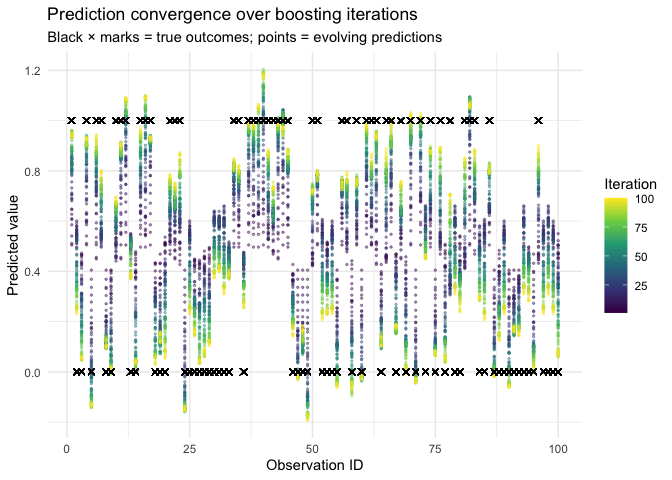
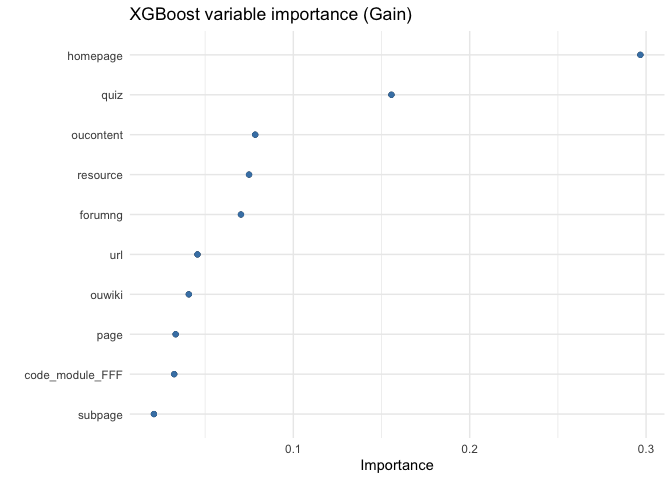

From Gradient Boosting to XGBoost
================
Will Doyle
2025-02-18

``` r
library(tidyverse)
library(tidymodels)
library(janitor)
library(xgboost)
library(vip)
library(rpart)
library(rpart.plot)
library(gganimate)
library(gifski)
```

------------------------------------------------------------------------

# Part 1: From Random Forests to Gradient Boosting

You already know random forests: build many independent trees on
bootstrapped samples and aggregate their predictions. Each tree is
ignorant of the others. Gradient boosting takes a different philosophy —
**trees are built sequentially, each one explicitly correcting the
mistakes of the ensemble so far**.

The key insight is this: if we know where our current predictions are
wrong (the residuals), we can train the *next* tree to predict those
residuals. Adding that tree’s predictions to our running total moves us
closer to the truth. Repeat this process many times and the ensemble
gradually “descends” toward the best possible predictions — hence
**gradient descent**.

## Gradient Descent via Residuals: The Core Idea

Here is the procedures:

1.  **Initialize** predictions as the global mean of the outcome (a
    reasonable starting guess).
2.  **Compute residuals**: the difference between the true values and
    the current predictions.
3.  **Fit a shallow tree** to predict those residuals using a random
    subset of data and features.
4.  **Update predictions** by adding a small fraction of the new tree’s
    predictions (scaled by the *learning rate* $\eta$).
5.  **Recompute residuals** and repeat.

After many iterations, the ensemble’s predictions converge toward the
true outcome. Each tree is a small correction; the learning rate keeps
any single tree from overcorrecting and sending predictions off course.

This is called **gradient descent** because the residuals of a
squared-error loss function are exactly its negative gradient. Fitting a
tree to residuals is equivalent to taking a step in the direction that
reduces prediction error most steeply. For other loss functions (e.g.,
log-loss for classification), the “residuals” are replaced by the
analogous gradient of the loss.

## Building Gradient Boosting By Hand

To make this concrete, let’s implement a simplified version from
scratch. We’ll use a 100-observation sample, keep it to numeric
predictors, and predict whether a student passed.

``` r
ou <- read_csv("oulad.csv") %>%
  mutate(result = fct_relevel(as_factor(result), c("passed", "not_passed"))) %>%
  select(-final_result)
```

    ## Warning: One or more parsing issues, call `problems()` on your data frame for details,
    ## e.g.:
    ##   dat <- vroom(...)
    ##   problems(dat)

    ## Rows: 32593 Columns: 33
    ## ── Column specification ────────────────────────────────────────────────────────
    ## Delimiter: ","
    ## chr (10): code_module, code_presentation, gender, region, highest_education,...
    ## dbl (22): id_student, num_of_prev_attempts, studied_credits, forumng, homepa...
    ## lgl  (1): repeatactivity
    ## 
    ## ℹ Use `spec()` to retrieve the full column specification for this data.
    ## ℹ Specify the column types or set `show_col_types = FALSE` to quiet this message.

``` r
sample_data <- ou %>%
  sample_n(100) %>%
  mutate(y = ifelse(result == "passed", 1, 0)) %>%
  select(where(is.numeric), -id_student)
```

Next, set our hyperparameters and initialize predictions as the mean:

``` r
eta            <- 0.1   # learning rate
sampling_rate  <- 0.8   # fraction of rows used per iteration
num_iterations <- 100   # number of boosting rounds
num_features   <- 5     # features randomly selected per round

# Initialize: predict the mean, compute residuals
sample_data <- sample_data %>%
  mutate(
    prediction = mean(y),
    residuals  = y - prediction
  )
```

Now the boosting loop. At each iteration we: sample the data, pick
random features, fit a tree to the **residuals**, predict on the full
dataset, and update.

``` r
# Storage for convergence plot
iteration_results <- tibble(ID = seq_len(nrow(sample_data)), y_true = sample_data$y)

for (i in seq_len(num_iterations)) {

  # 1. Subsample rows
  sampled_data <- sample_frac(sample_data, sampling_rate)

  # 2. Randomly select features (exclude bookkeeping columns)
  feature_cols     <- setdiff(names(sampled_data), c("y", "prediction", "residuals", "tree_output"))
  selected_features <- sample(feature_cols, num_features)

  # 3. Fit a regression tree to the residuals
  tree_formula <- as.formula(paste("residuals ~", paste(selected_features, collapse = " + ")))
  tree <- rpart(tree_formula, data = sampled_data, method = "anova")

  # (Uncomment to watch each tree)
   #rpart.plot(tree, main = paste("Iteration", i))

  # 4. Predict residuals for the full dataset and update predictions
  sample_data <- sample_data %>%
    mutate(
      tree_output = predict(tree, sample_data),
      prediction  = prediction + (eta * tree_output),
      residuals   = y - prediction
    )

  # Store predictions for visualization
  iteration_results[[paste0("iter_", i)]] <- sample_data$prediction
}
```

Each point is one iteration’s prediction value. Early iterations are
close to the mean; later ones have converged toward the true 0/1
outcomes. The learning rate $\eta$ controls how quickly (and how stably)
this happens.

``` r
ou <- read_csv("oulad.csv") %>%
  mutate(result = fct_relevel(as_factor(result), c("passed", "not_passed"))) %>%
  select(-final_result)

sample_data <- ou %>%
  sample_n(100) %>%
  mutate(y = ifelse(result == "passed", 1, 0)) %>%
  select(where(is.numeric), -id_student)

# ── Hyperparameters ───────────────────────────────────────────────────────────
eta           <- 0.1
sampling_rate <- 0.8
n_iter        <- 100
n_features    <- 5

# ── Boosting loop ─────────────────────────────────────────────────────────────
sample_data <- sample_data %>%
  mutate(prediction = mean(y), residuals = y - prediction)

all_preds <- tibble(
  ID         = seq_len(nrow(sample_data)),
  y_true     = sample_data$y,
  iteration  = 0L,
  prediction = sample_data$prediction
)

for (i in seq_len(n_iter)) {
  sampled_data      <- sample_frac(sample_data, sampling_rate)
  feature_cols      <- setdiff(names(sampled_data),
                               c("y", "prediction", "residuals", "tree_output"))
  selected_features <- sample(feature_cols, n_features)

  tree <- rpart(
    as.formula(paste("residuals ~", paste(selected_features, collapse = " + "))),
    data    = sampled_data,
    method  = "anova",
    control = rpart.control(maxdepth = 3)
  )

  sample_data <- sample_data %>%
    mutate(
      tree_output = predict(tree, sample_data),
      prediction  = prediction + eta * tree_output,
      residuals   = y - prediction
    )

  all_preds <- bind_rows(
    all_preds,
    tibble(
      ID         = seq_len(nrow(sample_data)),
      y_true     = sample_data$y,
      iteration  = i,
      prediction = sample_data$prediction
    )
  )
}


anim_data  <- filter(all_preds, iteration > 0)
truth_data <- distinct(anim_data, ID, y_true, iteration)


p <- ggplot() +
  geom_point(
    data  = anim_data,
    aes(x = ID, y = prediction, color = iteration),
    size  = 2.5,
    alpha = 0.85
  ) +
  geom_point(
    data   = truth_data,
    aes(x  = ID, y = y_true),
    shape  = 4,
    color  = "black",
    size   = 2.8,
    stroke = 1.2
  ) +
  scale_color_viridis_c(
    option = "viridis",
    limits = c(1, n_iter),
    name   = "Iteration"
  ) +
  scale_y_continuous(limits = c(-0.15, 1.2)) +
  labs(
    title    = "Gradient boosting convergence  \u00b7  iteration {frame_time}",
    subtitle = sprintf(
      "\u03b7 = %.2f  \u00b7  subsample = %.0f%%  \u00b7  features/split = %d",
      eta, sampling_rate * 100, n_features
    ),
    x       = "Observation",
    y       = "Predicted value",
    caption = "\u00d7 = true outcome     \u25cf viridis scale = earlier \u2192 later iterations"
  ) +
  theme_minimal(base_size = 14) +
  theme(
    plot.title    = element_text(face = "bold"),
    panel.grid.minor = element_blank(),
    plot.caption  = element_text(color = "grey50", hjust = 0)
  ) +
  transition_time(iteration) +
  shadow_mark(alpha = 0.2, size = 1.2)


animate(
  p,
  nframes  = n_iter,
  fps      = 2,
  width    = 900,
  height   = 550,
  renderer = gifski_renderer("gbm_convergence.gif")
)
```

### Watching Predictions Converge

``` r
plot_data <- iteration_results %>%
  pivot_longer(
    cols      = starts_with("iter_"),
    names_to  = "iteration",
    values_to = "prediction"
  ) %>%
  mutate(iteration_num = as.integer(str_extract(iteration, "[0-9]+")))

ggplot(plot_data, aes(x = ID, y = prediction, color = iteration_num, group = iteration)) +
  geom_point(alpha = 0.4,size=.5) +
  geom_point(aes(y = y_true), shape = 4, color = "black", size = 2, data = distinct(plot_data, ID, y_true,iteration)) +
  scale_color_viridis_c(name = "Iteration") +
  labs(
    title = "Prediction convergence over boosting iterations",
    subtitle = "Black × marks = true outcomes; points = evolving predictions",
    x = "Observation ID", y = "Predicted value"
  ) +
  theme_minimal()
```

<!-- -->

### How Good Did We Get?

``` r
results_tbl <- sample_data %>%
  mutate(y = as_factor(y)) %>%
  select(y, prediction)

roc_auc(results_tbl, truth = y, prediction, event_level = "second")
```

    ## # A tibble: 1 × 3
    ##   .metric .estimator .estimate
    ##   <chr>   <chr>          <dbl>
    ## 1 roc_auc binary             1

Not bad for a hand-rolled booster on 100 observations. In fact, a little
too good! It wouldn’t do well on testing data.

------------------------------------------------------------------------

# Part 2: XGBoost — Gradient Boosting, Engineered for Scale

Our hand-built booster captures the essential logic, but it leaves a lot
of performance on the table. **XGBoost (Extreme Gradient Boosting)**
extends the same framework with four major innovations:

## 1. Second-Order Optimization (the “Extreme” part)

Our booster uses only the **first derivative** (gradient) of the loss —
the residuals. XGBoost also incorporates the **second derivative**
(Hessian), which measures how steeply the gradient is changing. Think of
the gradient as knowing which direction is downhill; the Hessian tells
you *how steep* the slope is, allowing for a larger, more confident step
in flat regions and a smaller, more cautious step in steep ones.

This is analogous to Newton’s method for optimization versus plain
gradient descent. The result is that XGBoost typically reaches good
performance in fewer trees.

## 2. Regularization

XGBoost adds explicit $L_1$ and $L_2$ penalties on leaf weights and a
cost for adding extra leaves. This discourages overly complex trees and
acts as a continuous form of pruning. The `loss_reduction` parameter
(called $\gamma$ internally) requires a minimum gain before a split is
accepted.

## 3. Stochastic Subsampling

Like our hand-built version, XGBoost can subsample both **rows**
(`sample_size`) and **columns** (`mtry`) at each tree or each split.
This introduces the same diversity that makes random forests powerful,
while preserving the sequential correction structure of boosting.

## 4. Efficient Tree Construction via Weighted Quantile Sketching

Finding the best split in a continuous feature normally requires sorting
all values — expensive for large datasets. XGBoost uses **weighted
quantile sketching** to approximate the distribution of each feature
with a compact set of representative thresholds. Data points are
weighted by their second derivative (Hessian) so that observations with
more uncertain predictions (higher curvature) have more influence on
where splits are placed. This approximation is provably within a
controllable error bound, enabling XGBoost to handle millions of rows
efficiently.

## 5. Native Missing Data Handling

Rather than requiring imputation, XGBoost learns a default direction for
each split when a value is missing — sending missing observations left
or right based on which direction reduces loss more during training.

------------------------------------------------------------------------

# Part 3: Fitting XGBoost with tidymodels

## Data Setup

``` r
ou_split <- initial_split(ou)
ou_train  <- training(ou_split)
ou_test   <- testing(ou_split)
```

## Recipe

``` r
rf_formula <- as.formula("result ~ .")

ou_rec <- recipe(rf_formula, ou_train) %>%
  update_role(id_student, new_role = "id") %>%
  update_role(result, new_role = "outcome") %>%
  step_other(all_nominal_predictors(), threshold = 0.05) %>%
  step_unknown(all_nominal_predictors()) %>%
  step_dummy(all_nominal_predictors()) %>%
  step_zv(all_predictors())
```

## Model Specification

Each tunable parameter maps directly onto the theory above:

``` r
xgb_spec <- boost_tree(
  trees        = 100,
  tree_depth   = tune(),   # controls tree complexity
  min_n        = tune(),   # minimum observations per node
  loss_reduction = tune(), # γ: minimum gain to accept a split
  sample_size  = tune(),   # row subsampling fraction
  mtry         = tune(),   # column subsampling per split
  learn_rate   = tune()    # η: step size
) %>%
  set_engine("xgboost") %>%
  set_mode("classification")
```

### Hyperparameter Guide

| Parameter | What it controls | Higher values → | Lower values → |
|----|----|----|----|
| `tree_depth` | Max splits per tree | More complex trees, risk of overfit | Simpler, more regularized |
| `min_n` | Min obs to split a node | More conservative splits | More flexible |
| `loss_reduction` | Min gain ($\gamma$) to split | Fewer, higher-quality splits | More, finer splits |
| `sample_size` | Row subsampling fraction | Less randomness | More randomness, less overfit |
| `mtry` | Features per split | More deterministic | More diverse trees |
| `learn_rate` | Step size ($\eta$) | Faster, less stable | Slower, more stable |

**Practical starting points:** `learn_rate` between 0.01–0.1,
`tree_depth` between 3–6, `sample_size` around 0.7–0.9. Lower learning
rates typically require more trees.

## Workflow, Tuning Grid, and Resamples

``` r
ou_wf <- workflow() %>%
  add_recipe(ou_rec) %>%
  add_model(xgb_spec)

xgb_grid <- grid_space_filling(
  tree_depth(),
  min_n(),
  loss_reduction(),
  sample_size = sample_prop(),
  finalize(mtry(), ou_train),
  learn_rate(),
  size = 30
)

ou_rs <- vfold_cv(ou_train)
```

## Fit (or Load) Tuning Results

``` r
fit_model <- FALSE

if (fit_model) {
  xg_tune_res <- tune_grid(
    ou_wf,
    grid      = xgb_grid,
    resamples = ou_rs
  )
  save(xg_tune_res, file = "xg_tune_res.Rdata")
} else {
  load("xg_tune_res.Rdata")
}
```

## Explore Tuning Results

``` r
xg_tune_res %>%
  collect_metrics() %>%
  filter(.metric == "roc_auc") %>%
  pivot_longer(mtry:sample_size, names_to = "parameter", values_to = "value") %>%
  ggplot(aes(value, mean, color = parameter)) +
  geom_point(alpha = 0.8, show.legend = FALSE) +
  facet_wrap(~parameter, scales = "free_x") +
  labs(title = "Hyperparameter effects on ROC AUC", x = NULL, y = "AUC") +
  theme_minimal()
```

<!-- -->

``` r
show_best(xg_tune_res, metric = "roc_auc")
```

    ## # A tibble: 5 × 12
    ##    mtry min_n tree_depth   learn_rate loss_reduction sample_size .metric
    ##   <int> <int>      <int>        <dbl>          <dbl>       <dbl> <chr>  
    ## 1    15    11          5 0.0888          0.0118            0.462 roc_auc
    ## 2    29     6          9 0.0000596       0.00298           0.930 roc_auc
    ## 3    14     4          8 0.0206          0.000000429       0.199 roc_auc
    ## 4    20    20         11 0.0000000544    0.0000374         0.777 roc_auc
    ## 5    29    15          7 0.0000000234    0.00157           0.825 roc_auc
    ## # ℹ 5 more variables: .estimator <chr>, mean <dbl>, n <int>, std_err <dbl>,
    ## #   .config <chr>

## Finalize and Evaluate

``` r
best_auc <- select_best(xg_tune_res, metric = "roc_auc")

final_xgb <- finalize_workflow(ou_wf, best_auc)

final_res <- last_fit(final_xgb, ou_split)
```

    ## → A | warning: Passed invalid argument 'info' - entries on it should be passed as direct arguments. This warning will become an error in a future version.

    ## → B | warning: Passed invalid function arguments: nthread. These should be passed as a list to argument 'params'. Conversion from argument to 'params' entry will be done automatically, but this behavior will become an error in a future version.

    ## → C | warning: Parameter 'watchlist' has been renamed to 'evals'. This warning will become an error in a future version.

    ## → D | warning: Argument 'objective' is only for custom objectives. For built-in objectives, pass the objective under 'params'. This warning will become an error in a future version.

    ## There were issues with some computations   A: x1   B: x1   C: x1   D: x1There were issues with some computations   A: x1   B: x1   C: x1   D: x1

``` r
collect_metrics(final_res)
```

    ## # A tibble: 3 × 4
    ##   .metric     .estimator .estimate .config        
    ##   <chr>       <chr>          <dbl> <chr>          
    ## 1 accuracy    binary        0.882  pre0_mod0_post0
    ## 2 roc_auc     binary        0.945  pre0_mod0_post0
    ## 3 brier_class binary        0.0881 pre0_mod0_post0

------------------------------------------------------------------------

# Part 4: Interpreting the Model

## Variable Importance

XGBoost tracks three importance metrics for each feature across all
trees:

- **Gain**: Total reduction in loss when the feature is used to split.
  The most directly interpretable measure — how much does this feature
  improve predictions?
- **Cover**: Total number of observations affected by splits on this
  feature.
- **Frequency**: How often the feature is used for any split.

All three are normalized to sum to 1 (or 100%) for comparison. `vip`
defaults to Gain.

``` r
final_xgb %>%
  fit(data = ou_train) %>%
  extract_fit_parsnip() %>%
  vip(geom = "point") +
  geom_point(color = "steelblue") +
  labs(title = "XGBoost variable importance (Gain)") +
  theme_minimal()
```

    ## Warning in throw_err_or_depr_msg("Passed invalid argument 'info' - entries on
    ## it should be passed as direct arguments."): Passed invalid argument 'info' -
    ## entries on it should be passed as direct arguments. This warning will become an
    ## error in a future version.

    ## Warning in check.deprecation(deprecated_train_params, match.call(), ...):
    ## Passed invalid function arguments: nthread. These should be passed as a list to
    ## argument 'params'. Conversion from argument to 'params' entry will be done
    ## automatically, but this behavior will become an error in a future version.

    ## Warning in throw_err_or_depr_msg("Parameter '", match_old, "' has been renamed
    ## to '", : Parameter 'watchlist' has been renamed to 'evals'. This warning will
    ## become an error in a future version.

    ## Warning in check.custom.obj(params, objective): Argument 'objective' is only
    ## for custom objectives. For built-in objectives, pass the objective under
    ## 'params'. This warning will become an error in a future version.

<!-- -->

------------------------------------------------------------------------

# Summary: The Family Tree

| Method | Tree structure | How trees relate | Key strength |
|----|----|----|----|
| Single decision tree | Deep | Independent | Interpretable |
| Random forest | Deep | Independent (bagged) | Variance reduction |
| Gradient boosting | Shallow | Sequential (residuals) | Bias reduction |
| XGBoost | Shallow | Sequential + 2nd-order | Speed + regularization |

The move from random forests to gradient boosting shifts the focus from
*reducing variance through averaging* to *reducing bias through
sequential correction*. XGBoost adds engineering sophistication —
second-order updates, regularization, and approximate splitting — that
makes the approach practical at scale.
