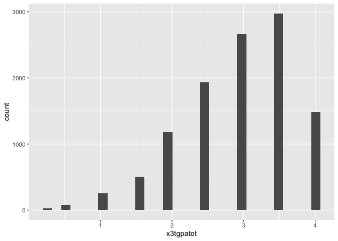

Quick intro to tidyverse/ggplot
================
Will Doyle
2025-01-09

## Tidyverse/GGPlot

## Load libraries

``` r
library(tidyverse)
```

    ## ── Attaching core tidyverse packages ──────────────────────── tidyverse 2.0.0 ──
    ## ✔ dplyr     1.1.4     ✔ readr     2.1.5
    ## ✔ forcats   1.0.0     ✔ stringr   1.5.1
    ## ✔ ggplot2   3.5.1     ✔ tibble    3.2.1
    ## ✔ lubridate 1.9.3     ✔ tidyr     1.3.1
    ## ✔ purrr     1.0.2     
    ## ── Conflicts ────────────────────────────────────────── tidyverse_conflicts() ──
    ## ✖ dplyr::filter() masks stats::filter()
    ## ✖ dplyr::lag()    masks stats::lag()
    ## ℹ Use the conflicted package (<http://conflicted.r-lib.org/>) to force all conflicts to become errors

``` r
library(tidymodels)
```

    ## ── Attaching packages ────────────────────────────────────── tidymodels 1.2.0 ──
    ## ✔ broom        1.0.6     ✔ rsample      1.2.1
    ## ✔ dials        1.3.0     ✔ tune         1.2.1
    ## ✔ infer        1.0.7     ✔ workflows    1.1.4
    ## ✔ modeldata    1.4.0     ✔ workflowsets 1.1.0
    ## ✔ parsnip      1.2.1     ✔ yardstick    1.3.1
    ## ✔ recipes      1.1.0     
    ## ── Conflicts ───────────────────────────────────────── tidymodels_conflicts() ──
    ## ✖ scales::discard() masks purrr::discard()
    ## ✖ dplyr::filter()   masks stats::filter()
    ## ✖ recipes::fixed()  masks stringr::fixed()
    ## ✖ dplyr::lag()      masks stats::lag()
    ## ✖ yardstick::spec() masks readr::spec()
    ## ✖ recipes::step()   masks stats::step()
    ## • Use tidymodels_prefer() to resolve common conflicts.

``` r
library(janitor)
```

    ## 
    ## Attaching package: 'janitor'
    ## 
    ## The following objects are masked from 'package:stats':
    ## 
    ##     chisq.test, fisher.test

## Load dataset

``` r
hs<-read_csv("hsls_extract.csv")%>%
  clean_names()
```

    ## Rows: 23503 Columns: 12
    ## ── Column specification ────────────────────────────────────────────────────────
    ## Delimiter: ","
    ## chr (9): X1PAR1EDU, X1PAR1EMP, X1HHNUMBER, X1FAMINCOME, X1STUEDEXPCT, X1IEPF...
    ## dbl (3): X1TXMTSCOR, X1SCHOOLENG, X3TGPATOT
    ## 
    ## ℹ Use `spec()` to retrieve the full column specification for this data.
    ## ℹ Specify the column types or set `show_col_types = FALSE` to quiet this message.

``` r
hs <- hs %>%
  mutate(across(-x1txmtscor, ~ ifelse(. < 0, NA, .)))%>%
  drop_na()
```

## Basics of Tidyverse

Tidyverse is an approach to programming in R. It’s guided by four
principles:

1.  Reuse existing data structures.

2.  Compose simple functions with the pipe.

3.  Embrace functional programming.

4.  Design for humans.

It even has a manifesto! Check it out:
<https://tidyverse.tidyverse.org/articles/manifesto.html>

Here’s an explanation of what’s going in the code above, which uses a
Tidyverse approach to replacing all negative values with missing, except
for the variable `x1tmtscor`

`hs <- hs %>%`

The hs data frame is being updated in place.

The `%>%` operator (pipe) is used to pass the data frame through a
series of transformations.

`mutate(across(-x1txmtscor, ~ ifelse(. < 0, NA, .)))`

`mutate()`: Used to create or modify columns in the data frame.

`across(-x1txmtscor, ~ ifelse(. < 0, NA, .))`

Applies a transformation to all columns except x1txmtscor:

`-x1txmtscor`: Excludes the column x1txmtscor from the operation.
`~ ifelse(. < 0, NA, .)` : A lambda function that replaces negative
values (. \< 0) in the selected columns with NA. The . refers to the
current column values.

Result: Negative values in all columns (except x1txmtscor) are replaced
with NA.

`drop_na()`

Removes all rows from the data frame that contain NA values in any
column.

## Outcome variable

``` r
hs%>%
  summarize(mean(x3tgpatot))
```

    ## # A tibble: 1 × 1
    ##   `mean(x3tgpatot)`
    ##               <dbl>
    ## 1              2.93

The `summarize` command “collapses” the data, using the operator
supplied, in this case `mean`

## GGPlot

``` r
hs%>%
ggplot(aes(x=x3tgpatot))+
  geom_histogram()
```

    ## `stat_bin()` using `bins = 30`. Pick better value with `binwidth`.

<!-- -->

GGPlot stands for grammer of graphics. The basic idea is that a graphic
consistes of elements that are mapped onto a geometry via an aesthetic
(eg x and y variables mapped onto a scatterplot). A description is here:
<https://ggplot2.tidyverse.org/>

## Outcome variable as a function of independent variable

Below, I use a tidyverse approach and then a ggplot approach to show
average GPA by levels of parental income.

## Table

``` r
hs%>%
  group_by(x1par1edu)%>%
  summarize(`Mean GPA`=mean(x3tgpatot))%>%
  arrange(`Mean GPA`)%>%
  rename(`Parental Education`=x1par1edu)
```

    ## # A tibble: 7 × 2
    ##   `Parental Education`                    `Mean GPA`
    ##   <chr>                                        <dbl>
    ## 1 Less than high school                         2.53
    ## 2 Unit non-response                             2.63
    ## 3 High school diploma or GED                    2.81
    ## 4 Associate's degree                            2.95
    ## 5 Bachelor's degree                             3.25
    ## 6 Master's degree                               3.34
    ## 7 Ph.D/M.D/Law/other high lvl prof degree       3.42

## Graphic

``` r
hs%>%
  group_by(x1par1edu)%>%
  summarize(`Mean GPA`=mean(x3tgpatot))%>%
  mutate(`Parental Education`=fct_reorder(x1par1edu,`Mean GPA`))%>%
  ggplot(aes(x=`Parental Education`,y=`Mean GPA`,fill=`Parental Education`))+
  geom_col()+
  coord_flip()+
  theme_minimal()+
  theme(legend.position="bottom")
```

<!-- -->
